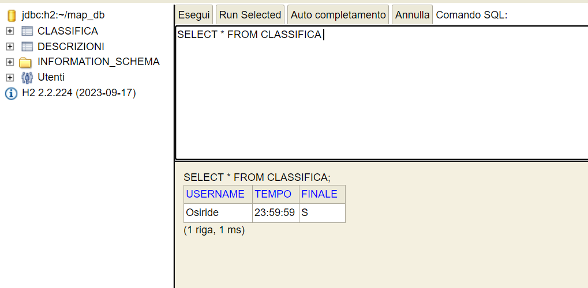
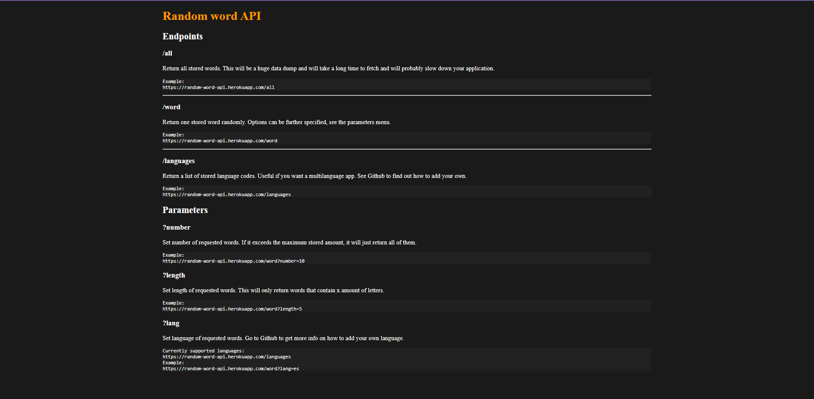
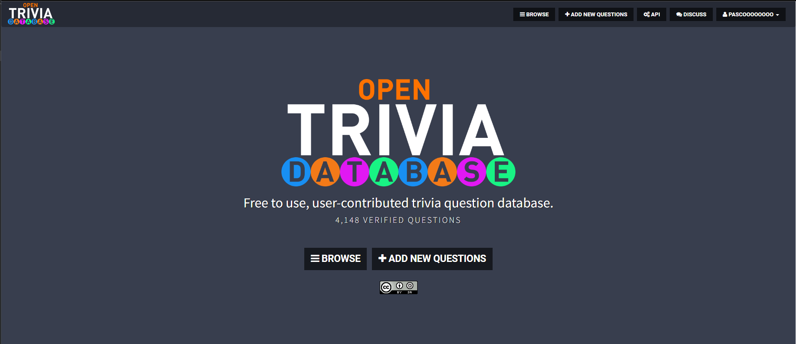

### In questa sezione verrà spiegato come sono stati applicati gli argomenti trattati durante il corso di "Metodi Avanzati di Programmazione" all'interno del progetto.

#### NOTA BENE: Gli snippet di codice presenti in questa sezione sono semplificati e non rappresentano l'intero codice del progetto, ma solo una parte significativa.


<ul>
    <li>
        <h2>1) Utilizzo dei file</h2>
        <details open>
            <summary>Visualizza dettagli</summary>
            <h3><b>Cosa sono i file?</b></h3>
Un file non è altro che un flusso di I/O che può essere utilizzato sia come sorgente che come destinazione di dati.

In Java, i file sono gestiti attraverso la classe File,che fornisce metodi per creare, eliminare, leggere, scrivere e gestire tutti i flussi di I/O nel Sistema Operativo.

- Un flusso può rappresentare molti tipi diversi: file su disco, dispositivi, altri programmi e array in memoria.
- Gli stream supportano molti tipi diversi di dati, inclusi byte semplici, tipi di dati primitivi, caratteri e oggetti.
- Alcuni flussi semplicemente trasmettono dati; altri manipolano e trasformano i dati.
- Indipendentemente dal modo in cui funzionano internamente, tutti i flussi presentano lo stesso modello: una sequenza di dati.

<h3><b>Come abbiamo utilizzato i file nel nostro progetto?</b></h3>
All'interno del nostro progetto i file sono stati utilizzati sia per l'inizializzazione del gioco, delle stanze che per il salvataggio.

La gestione dei file ci ha permesso di memorizzare e recuperare i dati del gioco in modo persistente, garantendo la continuità dell'esperienza di gioco per gli utenti.

Come appreso durante il corso, inoltre, abbiamo utilizzato i file in formato JSON per memorizzare i dati in modo strutturato e leggibile, facilitandone la gestione e la manipolazione.

- **Inizializzazione del gioco e caricamento di quest'ultimo**:

Per l'inizializzazione del gioco o il caricamento di quest'ultimo, abbiamo reso il nostro codice molto modulare, creando un unico metodo all'interno della classe <b>Converter</b> che si occupa di effettuare la conversione dei dati da JSON a Oggetti Java sia se si tratta di una nuova partita che di un caricamento di una partita salvata.


Per far ciò abbiamo creato due metodi ausialiari all'interno della classe <b>Converter</b>, il cui compito è solo quello di passare i path del file JSON da leggere e restituirli al metodo principale <b>convertJsonToJavaClass</b> che si occupa di effettuare la conversione dei dati da JSON a Java, come mostrato di seguito:
```java

  public Map<String, Agent> convertJsonToJavaClass() {
    return processJsonFiles("src/main/resources/static/Game.json", "src/main/resources/static/Agents.json");
  }


  public Map<String, Agent> loadGame() {
    return processJsonFiles("src/main/resources/LoadedGame.json", "src/main/resources/LoadedItems.json");
  }
  
```

In questo modo abbiamo evitato di creare due metodi distinti per la conversione dei dati da JSON a Java, rendendo il nostro codice più modulare e manutenibile.
Il metodo <b>processJsonFiles</b> ha come compito quello di andare a leggere i file JSON passati come parametri e restituirli in formato Java, andando a creare un oggetto di tipo <b>Map</b> contenente tutti gli agenti presenti nel gioco e inizializzando il gioco.

Particolarmente interessante è stata la registrazione di un TypeAdapter, mediante la libreria Gson, per la gestione degli Agenti all'interno del gioco, come mostrato di seguito:

```java
public class AgentDeserializer implements JsonDeserializer<Agent> {
    @Override
    public Agent deserialize(JsonElement json, Type typeOfT, JsonDeserializationContext context) throws JsonParseException {
        JsonObject jsonObject = json.getAsJsonObject();
        try {
            jsonObject.get("isPickable").getAsString();
            return context.deserialize(json, Item.class);
        } catch (NullPointerException e) {
            return context.deserialize(json, Personage.class);
        }
    }
}
```

Un <b>TypeAdapter</b> è un'interfaccia che definisce come un determinato tipo di oggetto può essere deserializzato da un oggetto Json.<br>
In questo caso il <b>TypeAdapter</b> si occupa di distinguere tra un oggetto di tipo Item e un oggetto di tipo Personage, in base alla presenza dell'attributo "isPickable", restituendo l'oggetto corretto in base al tipo di agente, dal momento che Item e Personage estendono la classe Agent.

Abbiamo scelto di adottare questa soluzione visto che, durante la lettura e l'instaziazione di oggetti da un file JSON, se ci sono oggetti che estendono la stessa classe, Gson non è in grado di distinguere tra i due tipi di oggetti, generando un'eccezione oppure restituendo un oggetto di una classe sbagliata.


- **Salvataggio del gioco**:


Tra gli utilizzi dei file, uno dei più importanti è sicuramente quello del salvataggio del gioco, anch'esso effettuato tramite file JSON.

La classe che si occupa di fare ciò è <b>Converter</b>, in particolare il suo metodo <b>ConvertGameToJson</b> e <b>ConvertAgentsToJson</b>, come mostrato di seguito:
```java
  public void ConvertGameToJson() {
    Gson gson = new Gson();
    Game game = Game.getInstance();
    String json = gson.toJson(game);
  }

  public void ConvertAgentsToJson() {
    Gson gson = new Gson();
    Game game = Game.getInstance();
    GameManager gameManager = new GameManager();
    Set<Item> allItems = gameManager.getAllItems();
  
    // Save only the items that are not in the inventory or in a room
    Set<Room> rooms = game.getCorridorsMap().stream()
            .map(Corridor::getStartingRoom)
            .collect(Collectors.toSet());
  
    Set<Item> itemsToSave = allItems.stream()
            .filter(item -> !game.getInventory().contains(item))
            .filter(item -> rooms.stream()
                    .noneMatch(room -> room.getAgents().contains(item)))
            .collect(Collectors.toSet());
  
    String json = gson.toJson(itemsToSave);
}
```

Il metodo <b>ConvertGameToJson</b> si occupa di convertire l'oggetto Game in formato JSON, mentre il metodo <b>ConvertAgentsToJson</b> si occupa di convertire gli oggetti di tipo Item in formato JSON, salvando solo gli oggetti che non sono presenti nell'inventario o in una stanza.


- **Inizializzione delle StopWords da txt**:

Per l'inizializzazione delle StopWords abbiamo utilizzato il metodo <b>setUpUselessWords</b> all'interno della classe <b>Parser</b>, che si occupa di leggere il file <b>StopWords.txt</b> e di inizializzarne la lista, come mostrato di seguito:
```java
private void setupUselessWords() throws Exception {
  Files.readAllBytes(Paths.get("src/main/resources/static/stopWords.txt"));
  File file = new File("src/main/resources/static/stopWords.txt");
  BufferedReader reader = new BufferedReader(new FileReader(file));

  while (reader.ready()) {
    stopWords.add(reader.readLine().trim().toLowerCase());
  }
  reader.close();
}
```

L'utilizzo dei file ci ha permesso di memorizzare e recuperare i dati del gioco in modo persistente, garantendo la continuità dell'esperienza di gioco per gli utenti e facilitando la gestione e la manipolazione dei dati all'interno del gioco.<br>
Inoltre, a nostro avviso, utilizzare al i file JSON al posto di implementare Serialazible ci ha permesso di avere un codice più pulito e leggibile, in quanto i file JSON sono più comodi da manipolare rispetto ai file binari.
</details>
</li>
<li>
<h2>2) Utilizzo del Database</h2>
<details open>
<summary>Visualizza dettagli</summary>
<h3><b>Cosa è un Database?</b></h3>
Uno dei motivi di successo di Java è dovuto alla possibilità di sviluppare applicazioni client/server indipendenti dalla piattaforma:

- L’indipendenza dalla piattaforma deve essere garantita
  anche per applicazioni che lavorano su basi di dati: per questo è nato lo standard Java Data Base Connectivity (JDBC)

<h4><b>Come funziona JDBC?</b></h4>
JDBC è progettato per essere platform-independent.

Per permettere ciò JDBC fornisce un driver manager che gestisce dinamicamente tutti gli oggetti driver di cui hanno bisogno le interrogazioni a database, quindi:
- Pertanto se si hanno tre diversi DBMS allora necessiteranno tre diversi tipi di oggetti driver.
- Gli oggetti driver si registrano presso il driver manager al momento del caricamento.
- Come tutte le API Java anche JDBC è stato progettato in modo da semplificare tutte le normali operazioni di interfacciamento con un database: connessione, creazione di tabelle, interrogazione e visualizzazione dei risultati.

<h3><b>Come abbiamo utilizzato il Database nel nostro progetto?</b></h3>
Come richiesto dal professore è stato utilizzato H2, un database SQL open-source scritto in Java. È molto veloce e leggero, e supporta la modalità server e la modalità embedded.

H2 è molto popolare in ambito di sviluppo di applicazioni Java, in quanto è facile da usare e da configurare, dunque perfetto per il nostro progetto.
L'utilizzo del database ci ha permesso di memorizzare i dati relativi a tutti i dialoghi del gioco, i punteggi dei giocatori e le informazioni sui tempi di gioco, garantendo la persistenza dei dati e la possibilità di recuperarli in qualsiasi momento.
Un ulteriore vantaggio di H2 è il fatto di avere una console web che permette di visualizzare i dati del database in modo semplice e intuitivo, facilitando il debug e il controllo dei dati memorizzati, come mostrato di seguito:


A seguito dell'inserimento dei dati nel database, è possibile visualizzare i dati memorizzati all'interno del database, come mostrato di seguito:


Oltre alla tabella principale contenente i dati relativi ai dialoghi del gioco, abbiamo creato una tabella per memorizzare i punteggi dei giocatori , come mostrato di seguito:



Il database, come appreso durante il corso, ha bisogno di una connessione per poter essere utilizzato. Per questo motivo, abbiamo implementato la classe <b>DatabaseConnection</b> per gestire la connessione al database e le operazioni di lettura e scrittura dei dati, come mostrato di seguito:
```java
    static final String JDBC_DRIVER = "org.h2.Driver";
    static final String DB_URL = "jdbc:h2:./src/main/resources/database/db_map";
    static final String USER = "sa";
    static final String PASS = "";
```
La classe <b>DatabaseConnection</b> definisce le costanti per il driver JDBC, l'URL del database, l'utente e la password per la connessione al database.

All'interno della classe <b>DatabaseConnection</b> sono stati implementati i metodi per la connessione al database, la creazione delle tabelle, l'inserimento dei dati e la lettura dei dati, come mostrato di seguito:
```java
    public static Connection connect() {
        String start = "RUNSCRIPT FROM 'src/main/resources/database/db_start.sql'";
        String fill = "RUNSCRIPT FROM 'src/main/resources/database/db_info.sql'";
        try {
             Connection conn = DriverManager.getConnection(DB_URL, USER, PASS);
             String sql = "SELECT * FROM CLASSIFICA";
             rs = stmt.executeQuery();
             rs.close();
             String sql2 = "SELECT * FROM DESCRIZIONI";
             stmt = conn.prepareStatement(sql2);
             rs = stmt.executeQuery();
             rs.close();
             return conn;
        } catch (SQLException e) {
            throw new RuntimeException(e);
        }
    }
```
Il metodo <b>connect</b> si occupa di connettersi al database, creare le tabelle, controllare se le tabelle sono vuote e popolarle con i dati di default, se necessario, restituendo la connessione al database.

Altri metodi fondamentali sono <b>close</b>, <b>printFromDB</b> e <b>getDescriptionFromDatabase</b> che permettono di chiudere la connessione al database, inserire i dati nel database, stampare i dati dal database, ottenere la classifica dei giocatori e ottenere le descrizioni delle stanze dal database, rispettivamente.
Andiamo a vederli nello specifico:
```java

public static void close(Connection conn) {
  if (conn != null) {
    try {
      conn.close();
    } catch (SQLException e) {
      throw new RuntimeException(e);
    }
  }
}
```
Il metodo <b>close</b> si occupa di chiudere la connessione al database, se è aperta.


```java
  public static void printFromDB(String idComando, String idStanza, String idStato, String idPersonaggio, String idOggetto1, String idOggetto2) {
      Connection conn;
      conn = DatabaseConnection.connect();
      String sql_query = "SELECT DESCRIZIONE FROM DESCRIZIONI WHERE COMANDO = '" + idComando + "' AND STANZA = '" + idStanza + "' AND STATO = '" + idStato + "' AND PERSONAGGIO = '" + idPersonaggio + "' AND OGGETTO1 = '" + idOggetto1 + "' AND OGGETTO2 = '" + idOggetto2 + "'";
      outputDisplayManager.displayText(DatabaseConnection.getDescriptionFromDatabase(conn, sql_query));
      DatabaseConnection.close(conn);
  }
```
Il metodo <b>printFromDB</b> si occupa di stampare la descrizione della stanza corrente, in base ai parametri passati, ottenuti dal database.

```java
  public static String getDescriptionFromDatabase(Connection conn, String sql_query) {
    try {
        Statement stmt = conn.createStatement();
        ResultSet rs = stmt.executeQuery(sql_query);
        if (rs.next()) {
            return rs.getString("DESCRIZIONE");
        }
        rs.close();
        stmt.close();
    } catch (SQLException e) {
        throw new RuntimeException(e);
    }
    return "No String Found";

}
```
Il metodo <b>getDescriptionFromDatabase</b> si occupa di ottenere la descrizione della stanza corrente dal database, in base alla query SQL passata come parametro.


In conclusione l'utilizzo del database ci ha fornito un modo comodo ed efficiente per memorizzare e recuperare i dialoghi del gioco e di gestire la classifica dei tempi di gioco.
</details>
</li>
<li>
<h2>3) Utilizzo dei Thread</h2>
<details open>
<summary>Visualizza dettagli</summary>
<h3><b>Cosa sono i Thread?</b></h3>
Un <b>Thread</b> è un flusso di esecuzione di un programma, ossia un processo che può essere eseguito in modo indipendente dagli altri processi. In Java, i Thread sono utilizzati per eseguire operazioni in modo concorrente, permettendo di sfruttare al massimo le risorse del sistema e di migliorare le prestazioni delle applicazioni.

La classe Thread di Java implementa tutte le funzionalità di un singolo thread e può essere creata in due modi:
- Estendendo la classe Thread, che prevede l'implementazione del metodo run() che contiene il codice da eseguire nel thread.
- Implementando l'interfaccia Runnable, che prevende il metodo run() che contiene il codice da eseguire nel thread.

A prescindere dal metodo utilizzato, il thread deve essere avviato chiamando il metodo start(), che avvia l'esecuzione del thread e chiama il metodo run().

Il thread può essere interrotto chiamando il metodo interrupt(), che invia un segnale di interruzione al thread, che può essere catturato e gestito nel metodo run().

Esiste anche il metodo join(), che permette di attendere che il thread termini la sua esecuzione.

<h3><b>Come abbiamo utilizzato i Thread nel nostro progetto?</b></h3>
Nel nostro progetto abbiamo utilizzato i Thread per gestire operazioni quali la riproduzione della musica di sottofondo, la gestione dell'input da parte dell'utente e il timer di gioco.

- **Musica di sottofondo**:
<br>
La musica di sottofondo è stata implementata utilizzando un thread separato, in modo che  possa essere riprodotta indipendentemente dal resto del gioco e possa essere interrotta o riprodotta nuovamente in qualsiasi momento, sia dal menù principale che dalla schermata di gioco, con ben 9 traccie audio diverse.

La classe che gestisce la musica di sottofondo è la classe <b>Mixer</b>, che estende la classe Thread e si occupa di caricare e riprodurre la musica di sottofondo, come mostrato di seguito:
```java
public class Mixer extends Thread {
    private static Clip[] clips; // array of clips
    private static int currentClip; // current clip index 
    private static boolean running = false; // running status
    private static HashMap<String, Integer> roomToClipIndex; // map room to clip index
    private static Mixer instance; // instance of Mixer

    private Mixer() {
        clips = new Clip[9];
        // load clips..

        // map room to clip instantiation
        roomToClipIndex = new HashMap<>();

        // populate map
    }
}
  ```

Il costruttore della classe <b>Mixer</b> si occupa di inizializzare l'array di Clip, l'indice corrente del clip, lo stato di esecuzione e la mappatura delle stanze all'indice della clip corrispondente.

```java  
  private void loadClip(int index, String filePath) {
    try {
      File file = new File(filePath);
      AudioInputStream audioStream = AudioSystem.getAudioInputStream(file);
      clips[index] = AudioSystem.getClip();
      clips[index].open(audioStream);
    } catch (Exception e) {
      e.printStackTrace();
    }
  }
  
  public static Mixer getInstance() {
    if (instance == null) {
      instance = new Mixer();
    }
    return instance;
  }
  ```

Il metodo <b>loadClip</b> si occupa di caricare il file audio in un oggetto Clip, mentre il metodo <b>getInstance</b> restituisce l'istanza della classe Mixer, garantendo che esista solo un'istanza della classe.

```java

  @Override
  public void run() {
    running = true;
    try {
      if (clips[0] != null) {
        clips[0].start();
        clips[0].loop(Clip.LOOP_CONTINUOUSLY);
        currentClip = 0;
      }
    } catch (Exception e) {
      System.out.println(e.getMessage());
    }
  }


  public static void startClip() {
    if (clips[currentClip] != null) {
      running = true;
      reverseIcons();
      clips[currentClip].start();
    }
  }
  ```

Il metodo <b>run</b> viene sovrascritto per avviare il thread e riprodurre la musica di sottofondo in modo continuo, mentre il metodo <b>startClip</b> viene utilizzato per avviare la riproduzione della musica.

```java
  public static void stopClip() {
    if (clips[currentClip] != null) {
      running = false;
      reverseIcons();
      clips[currentClip].stop();
    }
  }
  
  private static void changeClip(int i) {
    if (running) {
      if (clips[currentClip] != null) {
        clips[currentClip].stop();
      }
      if (clips[i] != null) {
        clips[i].start();
        clips[i].loop(Clip.LOOP_CONTINUOUSLY);
      }
    }
    currentClip = i;
  }
  ```
  
Il metodo <b>stopClip</b> viene utilizzato per fermare la riproduzione della musica, mentre il metodo <b>changeClip</b> viene utilizzato per cambiare il clip audio in base all'indice passato come parametro.

```java
  public static boolean isRunning() {
    return running;
  }
  
  public static void reverseIcons() {
    if (!running) {
      musicButtonSetTextGame("🔇");
      musicButtonSetTextMenu("🔇");
    } else {
      musicButtonSetTextGame("🔊");
      musicButtonSetTextMenu("🔊");
    }
  }
  
  public static void changRoomMusic(String room) {
    changeClip(roomToClipIndex.getOrDefault(room, 3));
  }

```
Il metodo <b>isRunning</b> restituisce lo stato di esecuzione della musica, il metodo <b>reverseIcons</b> cambia l'icona del bottone della musica in base allo stato di esecuzione e il metodo <b>changeRoomMusic</b> cambia il clip audio in base alla stanza passata come parametro.


- **La ProgressBar**:
<br>
La ProgressBar non è stata implementata direttamente nel nostro codice come Thread separato, quindi estendendo direttamente la classe Thread, ma sfruttando la classe Timer di Java che è essa stessa un Thread, come mostrato di seguito:<br>

```java
public class ProgressBarGUI extends JPanel {

    private JPanel runningGIFPanel; // panel for running GIF
    private JPanel backgroundPanel; // panel for background
    private JProgressBar progressBar; // progress bar
    private int counter; // counter for progress bar
    private int x; // x position for running GIF
    private final ImageIcon img; // running GIF
    private final PropertyChangeSupport support; // property change support
    private JLabel progressBarLabel; // label for progress bar

    // constructor
    public ProgressBarGUI() {
        initComponents();
        img = new ImageIcon("src/main/resources/docs/img/runningChar.png");
        x = -img.getIconWidth();
        support = new PropertyChangeSupport(this);
    }
    // add property change listener..
    // remove property change listener..
    //set progress bar value..
  
    // start progress bar
    public void startProgressBar() {
        int imgWidth = 161;
        int panelWidth = runningGIFPanel.getWidth();
        counter = 0;

        Timer timerP = new Timer();
        TimerTask taskProgressBar = new TimerTask() {
            @Override
            public void run() {
                if (counter < 100) {
                    counter++;
                    progressBar.setValue(counter);
                    progressBarLabel.setText("Loading... " + counter + "%");
                    x = (int) ((double) counter / 100 * (panelWidth + imgWidth)) - imgWidth;
                    runningGIFPanel.repaint();
                } else {
                    progressBarLabel.setText("Get Ready to Play!");
                    Timer timerPLW = new Timer();
                    TimerTask taskProgressBarLastWord = new TimerTask() {
                        @Override
                        public void run() {
                            setFinished(true);
                            timerPLW.cancel();
                        }
                    };
                    timerPLW.schedule(taskProgressBarLastWord, 1000);
                    timerP.cancel();
                }
            }
        };
        timerP.scheduleAtFixedRate(taskProgressBar, 0, 10);
    }
    
    //Sets the components..
}
```

Questa classe si occupa di creare e gestire la ProgressBar, inizializzando i componenti grafici, aggiungendo i listener per la gestione degli eventi e avviando la ProgressBar.

Il metodo <b>startProgressBar</b> si occupa di avviare la ProgressBar, incrementandone il valore e aggiornandone il testo fino a raggiungere il 100%, momento in cui la ProgressBar si ferma e mostra il messaggio "Get Ready to Play!".

Il metodo <b>setFinished</b> si occupa di impostare lo stato di completamento della ProgressBar, permettendo di avviare il gioco una volta completata.


- **Input da parte dell'utente**:

L'input da parte dell'utente è stato gestito utilizzando un thread separato, che è sempre in ascolto sul campo di testo in modo che i comandi inseriti dall'utente possano essere presi in modo indipendente e immediato.

La classe che gestisce l'input da parte dell'utente è la classe <b>UserInputManager</b> che si occupa di ricevere i comandi dall'utente e trasmetterli alla classe <b>UserInputFlow</b> per il corretto instradamento, come mostrato di seguito:
```java
public static void startInputListener() {
  new Thread(() -> {
    while (true) {
      if (!isCurrentInputEmpty()) {
        UserInputFlow.gameFlow(getCurrentInput());
      }
      try {
        Thread.sleep(100);
      } catch (InterruptedException e) {
        e.printStackTrace();
      }
    }
  }).start();
}

```
Questo codice gestisce l'ascolto degli input dell'utente. La funzione <b>startInputListener</b> avvia un thread che monitora continuamente il campo di input dell'utente. 

<b>Altri Thread sono stati istanziati ed utilizzati per piccoli task da eseguire contemporaneamente ad altre operazioni, come ad esempio:</b>

- **Setup degli elementi del gioco per una nuova partita**.
- **Setup degli elementi del gioco per una partita caricata da un file di salvataggio**.
- **Run del RestServer in background**.
- **Gestione del timer di gioco, attraverso la classe Timer**.
- **Timer per il cambiamento dei panel all'interno del gioco**.


Implementando i Thread all'interno del gioco siamo riusciti a garantire un'esperienza di gioco fluida e reattiva, permettendo all'utente di interagire con il gioco in modo intuitivo e coinvolgente, non accorgendosi della presenza di operazioni in background.


  </details>
  </li>
  <li>
    <h2>4) Utilizzo dei Socket</h2>
    <details open>
        <summary>Visualizza dettagli</summary>
        <h3><b>Cosa sono i socket ?</b></h3>
        In Java si usa un socket per creare la connessione ad un’altra macchina attraverso la rete. In particolare, per stabilire una connessione fra due computer occorrerà disporre di un socket su ogni macchina.Quest'ultimo non è che una astrazione software usata per
        rappresentare i terminali di una connessione tra due macchine.

In particolare, Java utilizza, per la comunicazione in rete, il <b>modello a stream</b>.

Un socket può mantenere due tipi di stream: uno di input ed uno di output. Dal punto di vista software, ciò che avviene è che un processo invia dei dati ad un altro processo attraverso la rete, scrivendo sullo stream di output associato ad un socket. Un altro processo, accede ai dati scritti in precedenza leggendo dallo stream di input del socket stesso.

Ci sono due classi socket basate su stream:

- ServerSocket che il server usa per ascoltare una
  richiesta di connessione
- Socket usata dal client per inizializzare la connessione<br>

Una volta che un client richiede una connessione
socket, il ServerSocket restituisce  un Socket corrispondente
attraverso il quale la comunicazione può avvenire
dal lato server.

Generalmente quando si crea un Serversocket, si specifica solo la porta del server a cui ci si vuole connettere, mentre quando si crea un Clientsocket si specifica, oltre alla porta del server a cui ci si vuole connettere, anche l'indirizzo IP del server.

Nel nostro caso, essendo il server e il client sulla stessa macchina, non è stato necessario specificare l'indirizzo IP.
<h3><b>Come abbiamo utilizzato i Socket nel nostro progetto?</b></h3>
Nel menu  del nostro gioco è presente un bottone "🌐", che apre, al click, una pagina web contenente le informazioni principali del gioco e le istruzioni per giocare.

Questo bottone è stato implementato utilizzando i socket sulla porta 8080, in particolare il metodo <b>openWebpage</b> che apre una connessione con il browser predefinito del sistema e carica la pagina web desiderata.
<h4><b>Che informazioni contiene il sito web?</b></h4>
Ecco come appare il sito web:


Il sito web contiene le seguenti informazioni:
- **Titolo del gioco**: il nome del gioco, ossia "Avventura nella Piramide".
- **Indice linkato**: permette di accedere rapidamente alle varie sezioni del sito web.
- **Migliori Tempi di Gioco**: mostra i migliori tempi di gioco degli utenti.
- **Manuale Utente**: spiega come giocare e le regole del gioco.
- **Spiegazione Progetto**: una breve descrizione del progetto e degli obiettivi.
- **Sviluppatori**: elenca i membri del team di sviluppo e il link al repository GitHub.<br>

Ovviamente ciascuna sezione contiene, al suo termine, un link che permette di tornare all'indice del sito web.

<h4><b>Come è stato implementato il socket?</b></h4>
All'interno del nostro codice, in particolare nel package "Database", sono presenti le classi che hanno permesso l'implementazione del socket.

Andiamo ad osservare il codice nel dettaglio:
```java
// Codice per l'inizializzazione del RestServer

public void startServer() throws IOException {
  HttpServer server = HttpServer.createSimpleServer("/", 8080);
  ServerConfiguration config = server.getServerConfiguration();
  config.addHttpHandler(new DatabaseHandler(), "/api/data");
  // Thread per avviare il server..
}
``` 
Nel metodo <b>startServer()</b> viene creato un oggetto di tipo <b>HttpServer</b> che si mette in ascolto sulla porta 8080. Viene inoltre aggiunto un <b>HttpHandler</b> che si occupa di gestire le richieste in arrivo sulla stessa porta.

```java
 private void handleGet(final Request request, final  Response response) throws IOException {
  response.setContentType("text/html");
  response.setCharacterEncoding("UTF-8");
  PrintWriter out = new PrintWriter(response.getWriter());
  try (Connection conn = DriverManager.getConnection("jdbc:h2:./src/main/resources/database/db_map", "sa", "");
       Statement stmt = conn.createStatement();
       ResultSet rs = stmt.executeQuery("SELECT * FROM CLASSIFICA ORDER BY TEMPO")) {
    out.println("<!DOCTYPE html>\n" +
            "<html lang=\"it\">\n" +
            "<head>\n" +
            "    <meta charset=\"UTF-8\">\n" +
            "    <meta name=\"viewport\" content=\"width=device-width, initial-scale=1.0\">\n" +
            "...");
            out.println("<tr><th> USERNAME </th><th> TEMPO </th><th> FINALE </th></tr>");
    while (rs.next()) {
      out.println("<tr><td>" + rs.getString("USERNAME") + "</td><td>" + rs.getString("TEMPO") + "</td><td>" +rs.getString("FINALE") + "</td></tr>");
    }
    out.println("</table><br>");

  } catch (SQLException e) {
    out.println("SQL Error: " + e.getMessage());
    e.printStackTrace(out);
    }
  // Rest of the HTML...
  
}
```
Nel metodo <b>handleGet()</b> viene gestita la richiesta GET in arrivo sulla porta 8080. Viene impostato il tipo di contenuto della risposta come "text/html" e viene creato un oggetto di tipo <b>PrintWriter</b> per scrivere la risposta.
Nel PrintWriter viene scritto il codice HTML della pagina web, e vengono recuperati i dati dal database e inseriti all'interno della tabella HTML.

Viene inoltre creato un clientSocket nella classe <b>Client</b> che si occuperà successivamente di effettuare una chiamata POST al nostro server per inserire nel database i dati relativi al tempo di gioco di una partita conclusa.


In conclusione, l'utilizzo dei socket ci ha permesso di creare un sito web per il nostro gioco, per permettere agli utenti di accedere alle informazioni principali del progetto e, allo stesso tempo, di sfidare gli altri giocatori per ottenere il miglior tempo di gioco.
</details>
</li>
<li>
    <h2>5) Utilizzo di Java Swing</h2>
    <details open>
        <summary>Visualizza dettagli</summary>
          <h3><b>Cosa è Java Swing?</b></h3>
        Java Swing è stato introdotto per la prima volta con Java 1.2 e ha sostituito il vecchio toolkit AWT (Abstract Window Toolkit) ed è il framework che permette la realizzazione di interfacce grafiche (GUI).

Essendo una libreria grafica, Java Swing permette di creare interfacce grafiche per applicazioni desktop, offrendo una vasta gamma di componenti grafici tra cui:

- Finestre, Form, Dialog
- Menu, Pulsanti, Check-box, Combo-box
- Alberi, Tabelle
- Layout, Look&Feel

<h3><b>Come abbiamo utilizzato Java Swing nel nostro progetto?</b></h3>
Il nostro progetto è stato sviluppato utilizzando interamente Java Swing per la realizzazione dell'interfaccia grafica del gioco, dal momento che volevamo creare un'esperienza di gioco coinvolgente e interattiva per l'utente.

Esso vanta lo sviluppo di una GUI molto ricca e complessa utilizzando un unico JFrame, che contiene tutti i componenti grafici necessari per l'interazione con l'utente attraverso l'utilizzo di JPanel e CardLayout.

L'utilizzo del Cardlayout, contenente al suo interno i vari JPanel, ci ha permesso di creare una GUI dinamica e flessibile, in grado di passare da una schermata all'altra in modo fluido e intuitivo e sopratutto di permettere sviluppi futuri senza dover modificare il codice esistente.

All'interno del nostro progetto, la classe principale che gestisce la GUI è la classe <b>ManagerGUI</b>, che estende la classe JFrame e si occupa di inizializzare e gestire tutti i componenti grafici del gioco, come mostrato di seguito:
```java

public class ManagerGUI extends JFrame {
  static GameGUI game; // The game GUI
  
  public ManagerGUI() {
    setDefaultCloseOperation(javax.swing.WindowConstants.EXIT_ON_CLOSE);
    setTitle("Avventura nella Piramide");
    setPreferredSize(new java.awt.Dimension(800, 600));
    setResizable(false);
    Image icon = ImageIO.read(new File("src/main/resources/docs/img/gameIcon.jpg"));
    setIconImage(icon);
    
    // Create the cards
    JPanel cards = new JPanel(new CardLayout());
    MenuGUI menu = new MenuGUI();
    CreditsGUI credits = new CreditsGUI();
    ProgressBarGUI progressBar = new ProgressBarGUI();
    game = new GameGUI();
    
    // Add the panels to cards
    cards.add(menu, "MenuGUI");
    cards.add(credits, "CreditsGUI");
    cards.add(progressBar, "ProgressBarGUI");
    cards.add(game, "GameGUI");
    // Start the frame and the music...
  }
  
  public static void closeGame() {
    game.goBack(); // Go back to the menu
  }
  
}

```
La classe <b>ManagerGUI</b> contiene solo un  metodo e  il costruttore, che si occupa di inizializzare e mostrare la finestra principale del gioco, impostando le proprietà del JFrame e creando i vari JPanel che costituiscono la GUI del gioco.
<br>
I panel verranno aggiunti al CardLayout, che permette di passare da una schermata all'altra in modo fluido e intuitivo.

Il metodo <b>closeGame()</b> permette di tornare al menu principale del gioco, chiamando il metodo <b>goBack()</b> del pannello del gioco.

Nel momento in cui il gioco viene avviato, viene mostrato il Menu principale, che contiene vari pulsanti per iniziare una nuova partita, caricare una partita salvata, visualizzare i crediti, aprire il sito web del gioco e attivare o disattivare la musica di sottofondo, come mostrato di seguito:


La classe che gestisce il Menu principale è la classe <b>MenuGUI</b>, che estende la classe JPanel e contiene tutti i componenti grafici del Menu, come mostrato di seguito:
```java

public class MenuGUI extends JPanel {
    private JPanel backgroundPanel; // The background panel
    private JButton newGame; // The new game button
    private static JButton sound; // The sound button
    private JButton help; // The help button
    private JButton loadGame; // The load game button
    private JButton credits;  // The credits button
    private JButton site; // The site button


    public MenuGUI() {
        initComponents();
    }


    private void initComponents() {
        // Create the components
        // Sets the background image
        // Initialize the buttons and set the properties...
        // Create  an action listener for each button...
        // Add the buttons to the panel...
        // Set the layout of the panel...
    }
}
```
La classe **MenuGUI** rappresenta il pannello principale del gioco e contiene vari pulsanti per azioni diverse. I componenti principali includono:

- backgroundPanel: un pannello che disegna un'immagine di sfondo.
- pulsanti: newGame, sound, help, loadGame, credits.


Nel costruttore, viene chiamato initComponents() per configurare i componenti della GUI.

Il metodo initComponents imposta il Jpanel dello sfondo e configura i vari pulsanti con testo e dimensioni specificate, aggiungendo un ActionListener a ciascun tasto per gestire i click.

La creazione di una nuova partita o il caricamento di una partita salvata, innescano la card successiva, che è la ProgressBar, che mostra il caricamento del gioco, come mostrato di seguito:


La ProgressBar è stata implementata utilizzando la classe <b>ProgressBarGUI</b>, che estende la classe JPanel e contiene tutti i componenti grafici necessari, come mostrato di seguito:
```java

public class ProgressBarGUI extends JPanel {
    private JPanel runningGIFPanel; // The running GIF panel
    private JPanel backgroundPanel; // The background panel
    private JProgressBar progressBar; // The progress bar
    private int counter;  // The counter
    private int x;    // The x position
    private final ImageIcon img; // The image icon
    private final PropertyChangeSupport support; // The property change support
    private JLabel progressBarLabel; // The progress bar label
  
    public void startProgressBar() {
        int imgWidth = 161;
        int panelWidth = runningGIFPanel.getWidth();
        counter = 0;
        // Primo TimerTask
        if (counter < 100) {
            counter++;
            progressBar.setValue(counter);
            progressBarLabel.setText("Loading... " + counter + "%");
            x = (int) ((double) counter / 100 * (panelWidth + imgWidth)) - imgWidth;
            runningGIFPanel.repaint();
        } else {
            progressBarLabel.setText("Get Ready to Play!");
            // Secondo TimerTask
            // Close the progress bar
        }
    }
}
```
Questo metodo <b>startProgressBar</b> è stato utilizzato per far partire la barra di progresso nella schermata di caricamento del gioco, in modo che l'utente possa capire quanto manca al completamento dell'azione.


Il metodo qui descritto, nonstante possa sembrare complesso a causa della presenza di due TimerTask, è in realtà molto semplice e intuitivo: il primo TimerTask si occupa di incrementare il valore della ProgressBar fino a 100, mentre il secondo TimerTask si occupa di fermare la ProgressBar e mostrare un messaggio di completamento.


A seguito del completamento della ProgressBar, la schermata di caricamento viene chiusa e l'utente viene portato alla schermata di gioco, dove finalmente si può iniziare a giocare.


La classe che gestisce la schermata di gioco è la classe <b>GameGUI</b>, che estende la classe JPanel e contiene tutti i componenti grafici del gioco, come mostrato di seguito:
```java
  public class GameGUI extends JPanel {
    private JButton goBackButton; // The go back button
    private JButton saveGameButton; // The save game button
    private JButton helpButton; // The help button
    private static JButton musicButton; // The music button
    private static JLabel timerLabel; // The timer label
    private static JPanel imagePanel; // The image panel
    private static JTextPane displayTextPane; // The display text pane 
    private JScrollPane scrollPaneDisplayText; // The scroll pane display text
    private static JTextArea inventoryTextArea; // The inventory text area
    private JScrollPane scrollPaneInventoryText; // The scroll pane inventory text
    private JTextField userInputField; // The user input field 
    private JToolBar toolBar; // The tool bar
    private static CardLayout cardLayout; // The card layout

    public GameGUI() {
        UIManager.put("ScrollBar.width", 0); // Set the width of the scroll bar to 0
        SwingUtilities.updateComponentTreeUI(this); // Update the UI of the component
        initComponents();
        initImagePanel();
    }

    initImagePanel() {
        // Create the image panel...
        // Adds all the images in the game to a CardLayout...
        // Assigns the card layout to the image panel...
    }

    private void initComponents() {
        // Create the components...
        // Set the properties of the components...
        // Create an action listener for each button...
        // Add the components to the panel...
        // Set the layout of the panel...
    }
}
    
```    
Allo stesso modo di <b>MenuGUI</b>, la classe <b>GameGUI</b> rappresenta il pannello principale del gioco e contiene vari pulsanti per azioni diverse, ciascuno con i propri ActionListener per gestire i click.


Il caricamento di una partita salvata avviene  allo stesso modo di una nuova partita, con l'unica differenza che il gioco viene caricato da un file di salvataggio.


Dopo aver cliccato il pulsante "Riconoscimenti", viene mostrata una schermata con i nomi dei membri del team di sviluppo, come mostrato di seguito:


La classe che gestisce i Riconoscimenti è la classe <b>RiconoscimentiGUI</b>, che estende la classe JPanel e contiene tutti i componenti grafici dei Riconoscimenti, come mostrato di seguito:

```java

public class CreditsGUI extends JPanel {
  private JButton goBack; // The go back button
  private JLabel titleLabel; // The title label
  private JPanel backgroundPanel; // The background panel 
  private JPanel marcoIcon; // The marco icon panel
  private JPanel pascoIcon; // The pasco icon panel
  private JPanel mikIcon; // The mik icon panel
  private JLabel contentLabel; // The content label

  public CreditsGUI() {
    initComponents();
  }

  initComponents() {
    // Create the components...
    // Set the properties of the components...
    // Create an action listener for the button...
    // Add the components to the panel...
    // Set the layout of the panel...
  }
}
```

Nel Menu principale del gioco è presente un bottone "Help", che apre, al click, una finestra di dialogo contenente le istruzioni per giocare, come mostrato di seguito:


La classe che mostra i comandi è la classe <b>HelpGUI</b>, che estende la classe JFrame e, con l'aggiunta di una JLabel permette la visualizzazione delle istruzioni del gioco.

All'interno del gioco sono presenti dei minigiochi che non sono semplicemente testuali, ma hanno la loro controparte grafica, come ad esempio il gioco delle mattonelle, il gioco della parola nascosta e il Wordle.

Tra questi quello che a nostro parere è il più interessante è il gioco del Wordle, che è stato implementato attraverso la classe <b>BoxLetter</b> che è strutturata nel seguente modo:
```java
public class BoxLetter {
    
  private JTextField textField; // The text field

  
  public BoxLetter() {
    textField = new JTextField(1); // Single character input
    textField.setFont(new Font("Papyrus", Font.BOLD, 30));
    textField.setHorizontalAlignment(JTextField.CENTER);((AbstractDocument) textField.getDocument()).setDocumentFilter(new SingleCharDocumentFilter());}

  public JTextField getTextField() {
    return textField;
  }
  
  protected void setBoxColor(Color color) {
    textField.setBackground(color);
  }
  
  private static class SingleCharDocumentFilter extends DocumentFilter {
      @Override
  public void insertString(FilterBypass fb, int offset, String string, AttributeSet attr) throws BadLocationException {
    if ((fb.getDocument().getLength() + string.length()) <= 1 && string.matches("[A-Z]")) {
      super.insertString(fb, offset, string, attr);
              }
         }
    }
}
```

Questa classe rappresenta una casella di testo in cui l'utente può inserire una singola lettera, in modo da indovinare la parola nascosta.
Assieme alla GUI, abbiamo implementato anche la logica del gioco, che permette all'utente di inserire una lettera e di verificare se la lettera è presente nella parola nascosta, come mostrato di seguito:


In conclusione, l'utilizzo di Java Swing ci ha permesso di creare un'interfaccia grafica coinvolgente e interattiva per il nostro gioco, rendendo l'esperienza di gioco più piacevole e stimolante per l'utente.
  </details>
</li>
<li>
<h2>6) Utilizzo delle Java REST</h2>
<details open>
    <summary>Visualizza dettagli</summary>
      <h3><b>Cosa è la Java REST?</b></h3>
La <b>Java Representational State Transfer (REST)</b> è un tipo di architettura software per i sistemi distribuiti ed è basata sulla trasmissione di dati tramite protocollo <b>HTTP</b>.

Proprio perché utilizza il protocollo HTTP, l'utilizzo principale della <b>Java REST</b> è quello di andare ad effettuare delle richieste ad un server e riceverà o invierà informazioni a seconda del verbo HTTP utilizzato.

I verbi HTTP principali sono:

- <b>GET</b>: per recuperare informazioni dal server.
- <b>POST</b>: per inviare informazioni al server.
- <b>PUT</b>: per aggiornare informazioni sul server.
- <b>DELETE</b>: per eliminare informazioni dal server.


<h3><b>Come abbiamo utilizzato la Java REST nel nostro progetto?</b></h3>


Nel nostro progetto abbiamo utilizzato le <b>Java REST</b> per rendere gli enigmi nelle stanze dinamici, in modo che l'utente possa avere un'esperienza di gioco più coinvolgente e varia, e andando a simulare in locale quello che è lo scambio e la ricezione dati di tipo client-server.

- **Enigma della Sfinge per l'entrata nella Piramide**:
  nella stanza iniziale del gioco, ossia il Deserto, la Sfinge pone un enigma all'utente, ossia indovinare una parola segreta di 5 lettere per poter entrare nella Piramide. Questo enigma è stato implementato utilizzando la Java REST, in modo che l'utente possa ricevere una parola diversa ogni partita, rendendo il gioco più interessante e stimolante.


L'API da noi utilizzata per generare le parole casuali è <a href="https://random-word-api.herokuapp.com/home">Random Word API</a>.

L'interfaccia dell'API è la seguente:

Come è possibile visualizzare dalla foto, questa API è molto ricca di endpoint, ognuno dei quali permette di ottenere informazioni diverse.

Tra le varie possibilità offerte da questa API, la funzionalità che ci interessava era quella di ottenere una parola casuale di una determinata lunghezza, dunque abbiamo scelto l'endpoint "/word" e abbiamo impostato il parametro "length" a 5, in modo da ottenere una parola di 5 lettere.<br>
Inoltre nell' endpoint "/languages" è possibile visualizzare la lingua in cui è possibile ottenere le parole casuali.<br>
A questo punto, modificando il link su cui effettuare la richiesta, possiamo ottenere la parola casuale di 5 lettere in italiano, come mostrato di seguito:
```http request
https://random-word-api.herokuapp.com/word?lang=it&length=5
```


Oltre quindi a fornirci immediatamente il link per effettuare la richiesta, possiamo notare anche la risposta in formato JSON e la sua semplice struttura:
```json
["venti"]
```
Il json restituito è un array con solo un elemento , contenente la parola casuale di 5 lettere in italiano, per questo motivo molto semplice da gestire e da interpretare.<br>
Per parsarlo e ottenere la parola casuale, non è stato nemmeno necessario usare la libreria Gson, bensì un banalissimo replace per eliminare le parentesi quadre e le virgolette.

Il codice per fare la GET e parsare la risposta è il seguente:
```java
public WordleGame() {
  String guessingWord1;
  StringBuilder result = new StringBuilder();

  try {
    URL url = new URL("https://random-word-api.herokuapp.com/word?lang=it&length=5");
    HttpURLConnection conn = (HttpURLConnection) url.openConnection();

    conn.setRequestMethod("GET");
    try (BufferedReader reader = new BufferedReader(
            new InputStreamReader(conn.getInputStream()))) {
      for (String line; (line = reader.readLine()) != null; ) {
        result.append(line);
      }
    }
    guessingWord1 = result.toString()
            .replace("[", "")
            .replace("]", "")
            .replace("\"", "")
            .toUpperCase();

  } catch (IOException e) {
    guessingWord1 = "SALVE";
  }
  GuessingWord = guessingWord1;
}
```


- **Enigma per poter entrare nella stanza del sarcofago**:
  All'interno della stanza numero 6 della nostra mappa abbiamo deciso di rendere difficile l'ingresso alla stanza del sarcofago mettendo alla prova l'utente con una serie di domande di varie categorie, dalla cultura generale a domande sui Computer o videogiochi. Per poter superare questa prova l'utente dovrà rispondere correttamente a 3 domande consecutive e, in caso di risposta errata, dovrà ricominciare da capo.


Per implementare questa funzionalità abbiamo utilizzato la Java REST, in particolare andando a cercare un database che permettesse di ottenere domande di varie categorie e difficoltà.

A nostro avviso l'API più adatta per questo scopo è <a href="https://opentdb.com/">Open Trivia Database</a>, un database di domande di trivia open-source che offre una vasta gamma di domande di varie categorie e difficoltà.

L'interfaccia del database è la seguente:


A questo punto, cliccando il pulsante API, possiamo andare ad analizzare l'interfaccia di nostro maggiore interesse, ossia la richiesta per ottenere domande di varie categorie e difficoltà:


I parametri possibili per la richiesta sono i seguenti:
- <b>amount</b>: il numero di domande da ottenere, nel nostro caso 1.
- <b>category</b>: l'ID della categoria delle domande, nel nostro  caso la scelta è stata lasciata a "Any Category", indicando che le domande possono essere di qualsiasi categoria.
- <b>difficulty</b>: la difficoltà delle domande, nel nostro caso la scelta è stata "Easy", indicando che le domande saranno di facile difficoltà, vista già la complessità della prova.
- <b>type</b>: il tipo di domande (multiple o boolean), nel nostro caso la scelta è stata "boolean", indicando che la risposta sarà vera o falsa.
- <b>encode</b>: il tipo di encoding della risposta, nel nostro caso la scelta è stata lasciata a "Default", evitando di aggiungere campi inutili alla richiesta.

A questo punto, cliccando il pulsante "Generate API URL", possiamo ottenere il link per effettuare la richiesta e vedere il risultato, che con i campi modificati risulta essere il seguente:


```http request
https://opentdb.com/api.php?amount=1&difficulty=easy&type=boolean
```


Per quanto riguarda la risposta, la struttura del JSON restituito è la seguente:
```json
{
  "response_code": 0,
  "results": [
    {
      "category": "General Knowledge",
      "type": "boolean",
      "difficulty": "easy",
      "question": "The Great Wall of China is visible from the moon.",
      "correct_answer": "False",
      "incorrect_answers": [
        "True"
      ]
    }
  ]
}
```


Dopo aver compreso il funzionamento dell'API, abbiamo implementato la richiesta all'interno del nostro codice Java, attraverso una semplice <b>GET</b>, come mostrato di seguito:
```java
  public static void getQAndA() {
  String urlToRead = "https://opentdb.com/api.php?amount=1&difficulty=easy&type=boolean";
  int maxAttempts = 3;

  // Try to get the question and answer from the API
  // if it fails 3 times, the player will have to talk to the mummy again
  for (int attempt = 0; attempt < maxAttempts; attempt++) {
      try {
          URL url = new URL(urlToRead);
          HttpURLConnection conn = (HttpURLConnection) url.openConnection();
          conn.setRequestMethod("GET");

          StringBuilder result = new StringBuilder();
          try (BufferedReader reader = new BufferedReader(new InputStreamReader(conn.getInputStream()))) {
              String line;
              while ((line = reader.readLine()) != null) {
                  result.append(line);
              }
          }

          JsonObject jsonObject = JsonParser.parseString(result.toString()).getAsJsonObject();

          question = jsonObject.getAsJsonArray("results").get(0).getAsJsonObject().get("question").getAsString().replace("&quot;", "\"")
                  .replace("&amp;", "&").replace("&apos;", "'").replace("&lt;", "<")
                  .replace("&gt;", ">").replace("&#039;", "'").replace("&eacute;", "é").replace("&egrave;", "è");
          correctAnswer = jsonObject.getAsJsonArray("results").get(0).getAsJsonObject().get("correct_answer").getAsString();

          displayQuestion(question);
          break;
        } catch (IOException e) {
      }
    }
}
```
Come è possibile notare dal codice, la richiesta viene effettuata attraverso un ciclo <b>for</b>, dovuto principalmente al fatto che in fase di testing l'API non rispondeva sempre correttamente, dunque abbiamo deciso di effettuare più tentativi per ottenere la singola domanda e salvarla nella variabile <b>question</b>.<br>

Per quanto riguarda la risposta, essa viene parsata e salvata nella variabile <b>correctAnswer</b>. 

Entrambe verranno utilizzate per visualizzare la domanda e controllare la risposta data dall'utente.


- **Simulazione Client-Server**:
<br>
Un'altra funzionalità interessante che abbiamo implementato utilizzando la Java REST è la possibilità di inviare i dati di gioco al server, in questo caso il database, in modo da poter salvare i migliori tempi di gioco degli utenti e visualizzarli sul sito web.

Per prima cosa, nel package Database abbiamo creato la classe <b>RESTServer</b>, che si occupa di avviare il server REST e di aggiungere i vari handler per gestire le richieste GET e POST, come mostrato di seguito:
```java
public class RestServer {
    public void startServer() throws IOException {
        HttpServer server = HttpServer.createSimpleServer("/", 8080);
        ServerConfiguration config = server.getServerConfiguration();
        config.addHttpHandler(new DatabaseHandler(), "/api/data");

        Runtime.getRuntime().addShutdownHook(new Thread(server::shutdownNow));
        // Start the server thread...
    }
}
```

La classe <b>DatabaseHandler</b> si occupa di gestire le richieste GET e POST all'endpoint "/api/data", come mostrato di seguito:
```java
public class DatabaseHandler extends HttpHandler {
    
  @Override
  public void service(final Request request, final Response response) throws Exception {
    if ("GET".equalsIgnoreCase(request.getMethod().toString())) {
      handleGet(request, response);
    } else if ("POST".equalsIgnoreCase(request.getMethod().toString())) {
      handlePost(request, response);
    }
  }
  
    private void handleGet(final Request request, final Response response) {
        // Handle the GET request by executing a query on the database and showing the results on the site
    }
  private void handlePost(final Request request, final Response response) throws IOException {
    response.setContentType("text/html");
    PrintWriter out = new PrintWriter(response.getWriter());
    try (Connection conn = DriverManager.getConnection("jdbc:h2:./src/main/resources/database/db_map", "sa", "");
         Statement stmt = conn.createStatement()) {
      stmt.executeUpdate("INSERT INTO CLASSIFICA (USERNAME, TEMPO, FINALE) VALUES ('"
              + request.getParameter("nickname") + "', '"
              + request.getParameter("score") + "', '"
              + request.getParameter("finalchoice") + "')");
    } catch (SQLException e) {
      out.println("SQL Error: " + e.getMessage() + "\n");
      e.printStackTrace(out);
    }
  }
}
```
La classe <b>DatabaseHandler</b> estende la classe <b>HttpHandler</b> e si occupa di gestire le richieste GET e POST all'endpoint "/api/data", in base al metodo della richiesta.
<br> Nel caso in cui la richiesta sia di tipo GET, viene chiamato il metodo <b>handleGet</b>, che si occupa di eseguire una query sul database e di mostrare i risultati sul sito.
<br> Nel caso in cui la richiesta sia di tipo POST, viene chiamato il metodo <b>handlePost</b>, che si occupa di inserire i dati inviati dalla richiesta nel database.

Tuttavia per poter effettuare una richiesta POST è necessario utilizzare un client, che nel nostro caso è rappresentato dalla classe <b>Client</b>, ed è strutturato come mostrato di seguito:
```java
public class Client {

  public void sendPostRequest(final String nickname, final String time, final String finalchoice) throws Exception {
    HttpClient client = HttpClient.newHttpClient();
    HttpRequest request = HttpRequest.newBuilder()
            .uri(URI.create("http://localhost:8080/api/data"))
            .header("Content-Type", "application/x-www-form-urlencoded")
            .POST(HttpRequest.BodyPublishers.ofString("username=" + nickname + "&tempo=" + time + "&finale=" + finalchoice))
            .build();
  }
}
```

Il metodo <b>sendPostRequest</b> si occupa di inviare una richiesta POST all'endpoint "/api/data", passando come parametri il nickname, il tempo e la scelta finale dell'utente, che verranno inseriti nel database.

La classe Client, tuttavia, non implementa alcun tipo di metodo per inviare la richiesta GET, questo perchè?


E' importante comprendere la presenza di un unico vero server all'interno del nostro progetto, ossia il Rest Server, che si occupa di avviare un vero e proprio HttpServer servendosi della libreria Grizzly, e di conseguenza un proprio Handler per gestire le richieste GET e POST.
Il database infatti, come detto all'inizio di questa sezione, non è altro che un server fittizio poichè il nostro intento, nonostante fosse quello di ricevere e scrivere dati sul database, non era certo quello di  mostrare il database sul sito web, bensì l'HTML, dunque effettuare la GET non avrebbe avuto senso.
</details>
</li>
        <h2>7) Utilizzo delle Espressioni Lambda </h2>
        <details open>
            <summary>Visualizza dettagli</summary>
            <h3><b>Cosa sono le Lambda expressions?</b></h3>
Le <b>lambda expressions</b> sono una caratteristica introdotta in Java 8 che permette di scrivere codice più conciso e leggibile.

Le espressioni lambda trasformano il flusso di esecuzione del programma, che assume la forma di una serie di valutazioni di funzioni. 
Di fatti sono un esempio di programmazione funzionale, un paradigma che, come il nome suggerisce, si basa sul calcolo di funzioni. Conseguenza di ciò è l'immutabilità: i valori non vengono calcolati cambiando lo stato del programma, ma costruendo nuovi stati a partire dai precedenti.
La programmazione funzionale ha le sue radici nel lambda calcolo, composto da un linguaggio formale utilizzato per esprimere le funzioni e un sistema di riscrittura per stabilire come i termini possano essere ridotti e semplificati.

Il loro utilizzo è particolarmente utile quando si devono passare una o più funzioni come parametro ad un metodo, come ad esempio nei metodi di ordinamento o di filtraggio di una collezione, evitando scrittura di codici "poco eleganti" poichè fortemente connesse alle caratteristiche di classe e non alla logica, evitando inoltre riscritture pesanti in caso di cambiamenti.

Un’espressione lambda è composta:
- da una lista di parametri separati da virgole e racchiusi tra parentesi tonde (E' possibile omettere le parentesi tonde se il metodo ha un solo parametro o un tipo).
- dal token <code>-></code> che separa i parametri dal corpo della lambda.
- da un corpo che contiene una singola espressione o un blocco di istruzioni. Il
  blocco di istruzioni è racchiuso nelle parentesi graffe <code>{}</code>. Se il blocco di
  istruzioni contiene un’invocazione ad un metodo che non restituisce nessun
  valore (void) si possono omettere le parentesi

<h3><b>Come abbiamo utilizzato le Lambda expressions nel nostro progetto?</b></h3>
L'utilizzo migliore delle lambda expressions in un gioco testuale è sicuramente quello relativo all'implementazione dei comportamenti dei comandi, in quanto permette di semplificare di molto il codice, oltre che renderlo più leggibile.
Ma non è l'unico utilizzo che ne abbiamo fatto, andiamo a vederli all'interno del nostro progetto:

- **Mappa dei comandi**: 
  Per gestire i comandi all'interno del gioco, abbiamo utilizzato una mappa di comandi, in cui ad ogni tipo comando è associata una lambda expression che ne definisce il comportamento.

  Ecco un esempio di codice che mostra come abbiamo implementato la mappa dei comandi all'interno del gioco:
```java
private HashMap<CommandExecutorKey, CommandBehavior> commandMap;

public CommandExecutor(Game game) {
    this.game = game;
    this.gameLogic = new GameLogic(game);
    commandMap = new HashMap<>();

    //other commands...

    commandMap.put(new CommandExecutorKey(CommandType.USA, 2),
            p -> {
                if (game.getInventory().contains(p.getAgent1())) {
                    if (game.getCurrentRoom().getAgents().contains(p.getAgent2())) {
                        String statusBeforeAction = game.getCurrentRoom().getState();
                        if (gameLogic.executeUseCombinationInRoom((Item) p.getAgent1(), (Item) p.getAgent2())) {
                            DatabaseConnection.printFromDB("Usa", game.getCurrentRoom().getName(), statusBeforeAction, "0", p.getAgent1().getName(), p.getAgent2().getName());
                        } else {
                            OutputDisplayManager.displayText("> Non puoi usare " + p.getAgent1().getName() + " su " + p.getAgent2().getName() + "!");
                        }
                    } else if (game.getInventory().contains(p.getAgent2())) {
                        if (gameLogic.executeUseCombinationInInventory((Item) p.getAgent1(), (Item) p.getAgent2())) {
                            DatabaseConnection.printFromDB("Usa", "0", "0", "0", p.getAgent1().getName(), p.getAgent2().getName());
                        } else {
                            OutputDisplayManager.displayText("> Non puoi usare " + p.getAgent1().getName() + " su " + p.getAgent2().getName() + "!");
                        }
                    } else {
                        OutputDisplayManager.displayText("> " + p.getAgent2().getName() + " non è qui con noi!");
                    }
                } else {
                    OutputDisplayManager.displayText("> " + p.getAgent1().getName() + " non è nell'inventario!");
                }
            });

    //other commands...

}
```
In questa parte di codice è definita la entry del dizionario riguardante il comando "USA", in particolare il caso in cui vogliamo usare un oggetto su un altro oggetto (vedi il numero 2 nella dichiarazione della chiave).
Per la lambda expression da associare abbiamo definito un'interfaccia funzionale <code>CommandBehavior</code> che contiene un metodo <code>execute</code> che prende in input un oggetto di tipo <code>ParserOutput</code> e non restituisce nulla.
Di fatti nella entry per il comando "USA", p è un oggetto di tipo <code>ParserOutput</code> che contiene i due oggetti su cui vogliamo eseguire l'azione.
Il corpo della lambda expression si occupa di effettuare molteplici controlli: prima di tutto verifica che il primo oggetto sia presente nell'inventario, se sì allora verifica se il secondo si trova anch'esso nell'inventario oppure nella stanza in cui si trova il giocatore;
poi chiama il metodo <code>executeUseCombinationInRoom</code> o <code>executeUseCombinationInInventory</code> a seconda dei casi. Questi metodi si occupano di verificare ed eseguire la combinazione di utilizzo tra i due oggetti, restituendo <code>true</code> se l'azione è presente ed è stata eseguita, <code>false</code> altrimenti.
A seconda dei diversi casi poi, viene stampato un determinato messaggio sul display.


A seguito l'elenco di tutti gli altri comandi, anch'essi implementati attraverso le lambda:
### Comandi Disponibili:

1. **Comando AIUTO**:
  - **Descrizione**: Stampa l'elenco dei comandi disponibili.

2. **Comando OSSERVA**:
  - **0 argomenti**: Stampa la descrizione della stanza corrente.
  - **1 argomento**: Stampa la descrizione dell'agente specificato.

3. **Comando INVENTARIO**:
  - **Descrizione**: Stampa l'inventario.

4. **Comando PRENDI**:
  - **Descrizione**: Permette di raccogliere un oggetto e metterlo nell'inventario.

5. **Comando LASCIA**:
  - **Descrizione**: Permette di lasciare per terra un oggetto nell'inventario.

6. **Comando USA**:
  - **Descrizione**: Ha due implementazioni, una con nessun argomento e una con un solo argomento.

7. **Comando UNISCI**:
  - **Descrizione**: Permette di unire due oggetti per crearne uno nuovo.

8. **Comando PARLA**:
  - **Descrizione**: Permette di parlare con un personaggio.

9. **Comando DAI**:
  - **Descrizione**: Permette di dare un oggetto a un personaggio.

10. **Comando NORD|EST|SUD|OVEST**:
  - **Descrizione**: Permettono il movimento del giocatore da una stanza all'altra. In particolare, per questi quattro comandi, la lambda expression è stata ulteriormente generalizzata.


```java
private CommandBehavior createDirectionCommandBehavior(CommandType direction) {
    return p -> {
        Corridor corridor = game.getCorridorsMap().stream()
                .filter(c -> c.getStartingRoom().equals(game.getCurrentRoom()) && c.getDirection() == direction)
                .findFirst()
                .orElse(null);

        if (corridor != null && !corridor.isLocked()) {
            game.setCurrentRoom(corridor.getArrivingRoom());
            outputDisplayManager.displayText("You moved to the " + direction);
        } else if (corridor != null && corridor.isLocked()) {
            outputDisplayManager.displayText("The corridor is locked");
        } else {
            outputDisplayManager.displayText("There is no corridor to the " + direction);
        }
    };
}
```

Questo metodo, sempre facente parte della classe <code>CommandExecutor</code>, si occupa di creare la lambda expression per i comandi di direzione (specificato attraverso il parametro direction), in modo da evitare la duplicazione del codice.
La lambda expression inizia con un ulteriore lambda che prende tutti i corridoio presenti nel gioco e cerca il corridoio che parte dalla stanza correntp e che va nella direzione specificata.
Il risultato di questa ricerca viene poi usato per controllare se il corridoio esiste e se è bloccato o meno, stampando un messaggio appropriato a seconda dei casi.
Nel caso in cui il corridoio esista e non sia bloccato, il giocatore viene spostato nella stanza di arrivo del corridoio.

- **Assegnazione dei Task ai Thread**
  In alcuni casi abbiamo creato dei Thread per eseguire operazioni in background, come l'esecuzione del server REST durante l'esecuzione del programma ed il set up del game flow in caso di nuova partita e caricamento di una partita salvata in contempornea al caricamento della progress bar.

- **Aggiornamento posticipato della GUI del gioco della parola nascosta**
  Similmente al punto precedente, sono state utilizzate delle lambda per assegnare al metodo statico <code>invokeLater</code> della classe <code>SwingUtilities</code> il compito di aggiornare la GUI del gioco della parola nascosta al momento più appropriato.

- **Inizializzazione degli actionListener dei bottoni delle varie GUI**

- **Sovrascrittura di proprietà estetiche di alcuni componenti delle GUI**

- **Assegnazione dei task ai TimerTask**
  Usati, ad esempio, nella progressBar e nel timer del gioco.

- **Contribuzione al parsing dell'input**
  Tra le altre cose, parte del parsing dell'input è svolto mediante lambda expressions, in particolare lo split ed eliminazione delle stopWords e la ricerca all'interno dei set di aliases. A seguito il codice:
```java
public class Parser {
    // Attributes declaration...

    public ParserOutput parse(String input) {
      // rest of the code...
        
      words = Arrays.stream(input.split(" "))
                .map(String::toLowerCase)
                .filter(w -> !stopWords.contains(w))
                .toArray(String[]::new);

      // rest of the code...

      String theAlias = agent.getAliases().stream()
                .filter(alias -> alias.equalsIgnoreCase(words[2]))
                .findFirst()
                .orElse(null);
      if (theAlias != null) output.setAgent2(agent);

      // rest of the code...
    }

  // Other methods...
}
```
In particolare, la prima lambda expression si occupa di splittare la stringa in input in un array di stringhe, trasformarle in lowercase, filtrare le stopWords e trasformare il tutto in un array di stringhe.
La seconda lambda expression si occupa di cercare all'interno degli alias dell'agente specificato se è presente una corrispondenza con la terza parola inserita dall'utente, trasformata in lowercase. Se la corrispondenza è trovata, l'agente viene settato come secondo agente dell'output.

- **Creazione di un set contenente tutti gli Items del gioco**
  All'interno della classe GameManager è presente un metodo che a partire dalla mappa di tutti gli agenti mappati ai loro nomi crea un set contenente tutti gli Items del gioco. Ecco il codice:
```java
public class GameManager {
    private static Map<String, Agent> allAgents;

    // Other attributes declaration...
  
    // Other methods...

    public Set<Item> getAllItems() {
         Set<Item> allItems = allAgents.values().stream()
              .filter(agent -> agent instanceof Item)
              .map(agent -> (Item) agent)
              .collect(Collectors.toSet());
        return allItems;
    }

    // Other methods...
}
```

- **Conversione da file Json ad oggetti e viceversa**
  Infine, le lambda expressions sono state utilizzate per l'istanziazione di tutti i componenti del gioco a partire dai file base, nel caso di una nuova partita o dai file di salvataggio, nel caso di un partita da caricare.
  Stessa cosa è stata fatta per la conversione da oggetti a file Json, per salvare lo stato del gioco. A seguito il codice relativo:
```java
public class Converter {
    // Other methods...

  private Map<String, Agent> processJsonFiles(String gameFilePath, String agentsFilePath) {
        // rest of the code...
  
        game.getInventory().forEach(item -> allAgents.put(item.getName(), item));

        game.getCorridorsMap().forEach(corridor -> {
          Room room = corridor.getStartingRoom();

          if (!allRooms.containsKey(room.getName())) {
            allRooms.put(room.getName(), room);
            room.getAgents().forEach(agent -> allAgents.put(agent.getName(), agent));
          } else {
            Room existingRoom = allRooms.get(room.getName());
            corridor.setStartingRoom(existingRoom);
          }

          room = corridor.getArrivingRoom();

          if (!allRooms.containsKey(room.getName())) {
            allRooms.put(room.getName(), room);
            room.getAgents().forEach(agent -> allAgents.put(agent.getName(), agent));
          } else {
            Room existingRoom = allRooms.get(room.getName());
            corridor.setArrivingRoom(existingRoom);
          }
        });
        
      // rest of the code...
  }

  public void ConvertAgentsToJson() {
    // rest of the code...

    // Save only the items that are not in the inventory or in a room
    Set<Room> rooms = game.getCorridorsMap().stream()
            .map(Corridor::getStartingRoom)
            .collect(Collectors.toSet());

    Set<Item> itemsToSave = allItems.stream()
            .filter(item -> !game.getInventory().contains(item))
            .filter(item -> rooms.stream()
                    .noneMatch(room -> room.getAgents().contains(item)))
            .collect(Collectors.toSet());

    // rest of the code...
  }
}
```
Il metodo <code>processJsonFiles</code> si occupa di leggere i file Json contenenti le informazioni del gioco e di creare tutti gli agenti e le stanze del gioco a partire da essi.
In particolare, per evitare duplicazioni di Agenti e Stanze, vengono utilizzate delle lambda expressions per controllare se una stanza è già presente nella lista di tutte le stanze, se non lo è allora i suoi agenti vengono inseriti nella mappa di tutti gli agenti e la stanza è inserita nella lista di tutte le stanze; 
se lo è, invece, viene presa la sua copia già istanziata e viene utilizzata quella per proseguire con l'instanziazione della partita.
Il secondo metodo, <code>ConvertAgentsToJson</code>, interviene invece quando dobbiamo salvare, si occupa di convertire tutti gli agenti del gioco in file Json, in modo da poter salvare lo stato del gioco.
In particolare, viene creato un set di Stanze, così da evitare duplicati, poi viene creato un set di Item che non sono presenti nell'inventario o in una stanza, il risultato viene salvato nel file json.


In conclusione, l'utilizzo delle lambda expressions ci ha permesso di scrivere codice più conciso e leggibile, semplificando la gestione dei comandi, la gestione di tutte le operazioni che richiedono l'implementazione di interfacce funzionali e la gestione dei dati all'interno del gioco.
</details>
</ul>

Ritorna al [Report](Report.md)