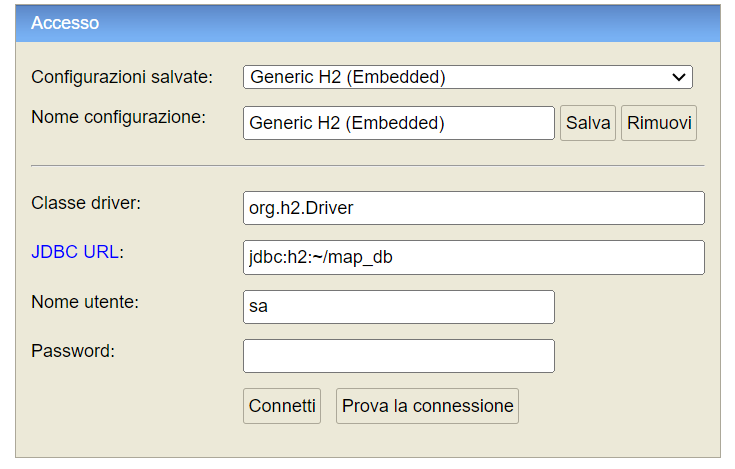
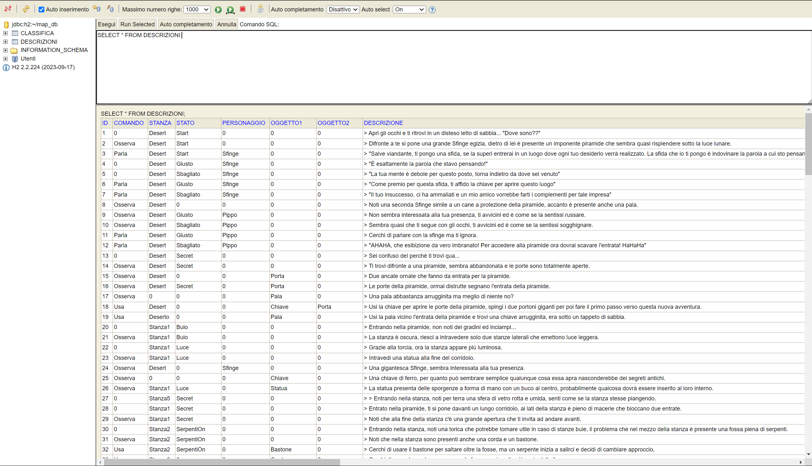

# //INSERIRE TITOLO

# Report
## Indice
- ### [**1 - Introduzione**](#1---introduzione)
    -  [**1.1 - Sviluppatori**](#partecipanti-al-progetto)
    -  [**1.2 - Descrizione Progetto**](#descrizione-progetto)
- ### [**2 - Modello di Dominio**](#2---modello-di-dominio)
    - [**2.1 - Chiarimenti scelte progettuali**](#chiarimenti-scelte-progettuali)
- ### [**3 - Progettazione**](#3---progettazione)
    - [**3.1 - Diagramma delle Classi**](#diagramma-delle-classi)
- ### [**4 - Requisiti Specifici**](#4---requisiti-specifici)
    -  [**4.1 - Requisiti Funzionali**](#requisiti-funzionali)
    - [**4.2 - Requisiti Non Funzionali**](#requisiti-non-funzionali)
- ### [**5 - Specifiche Algebriche**](#5---specifiche-algebriche)
- ### [**6 - Applicazione Argomenti del Corso**](#6---applicazione-argomenti-del-corso)
- ### [**7 - Manuale Utente**](#7---manuale-utente)
    - [**7.1 - Procedura Preliminare**](#procedura-preliminare)
- ### [**8 - Analisi Retrospettiva**](#8---analisi-retrospettiva)
    - [**8.1 - Mad-Sad-Glad**](#mad-sad-glad)
    - [**8.2 - Miglioramenti Proposti**](#miglioramenti-proposti)
- ### [**9 - Conclusioni e Opinioni Finali**](#9---conclusioni-e-opinioni-finali)

## 1 - Introduzione
<hr>

## Partecipanti al progetto
<hr>

Il team di sviluppatori è composto da:
+ **Michele Pontrelli** ([MikiMik88](https://github.com/MikiMik88))
+ **Nicolo' Pacucci** ([Pascoooo](https://github.com/Pascoooo))
+ **Ruggiero Marco Santeramo** ([Apand0](https://github.com/Apand0))
<!-- 
<div style="text-align: left">
    
</div>
-->

## Descrizione Progetto
<hr>

L'avventura testuale //INSERIRE TITOLO è stata implementata come progetto per l'esame "Metodi Avanzati di Programmazione", corso tenutosi dal docente [Pierpaolo Basile](https://github.com/pippokill)
nell'anno accademico 2023/24, presso l'Università degli Studi di Bari "Aldo Moro".

Il progetto è stato sviluppato in linguaggio di programmazione Java, utilizzando il framework Maven per la gestione delle dipendenze e per la compilazione del progetto.

#### [Ritorna all'Indice](#indice)

## 2 - Modello di Dominio
<hr>

- Il seguente diagramma rappresenta il modello di dominio della nostra avventura testuale, realizzata utilizzando il web software [Lucidchart](https://www.lucidchart.com/)
  

## Chiarimenti scelte progettuali

- Relazioni **Parser**  ⇄ **Partita:**
<hr>
La relazione tra il <b>Parser</b> e la <b>Partita</b> è stata progettata in modo tale che il **Parser** possa ricevere i comandi dall'utente e trasmetterli alla **Partita** per l'esecuzione. Inoltre, il **Parser** può ricevere informazioni sulla situazione di gioco dalla **Partita** e presentarle all'utente.
- Relazioni **Parser**  ⇄ **Comandi:**
<hr> 

- Relazioni **Parser**  ⇄ **Agente:**
<hr>

- Relazioni **Partita**  ⇄ **Stanza:**
<hr>

- Relazioni **Stanza**  ⇄ **Agente:**
<hr>

- Relazioni **Agente**  ⇄ **Oggetto/Personaggio:**
<hr>


#### [Ritorna all'Indice](#indice)

## 3 - Progettazione
- Il nostro principale obiettivo di progettazione è stato:
    - Creare un'architettura modulare e scalabile che permetta di aggiungere nuove funzionalità in modo semplice e flessibile.

Questo obiettivo è stato pienamente rispettato dal modello di progettazione adottato, ossia il **Modello Entity-Controller-Boundary (ECB)**.
<h3> Che cos'è il Modello Entity-Controller-Boundary?</h3>
- Il **Modello ECB** è un modello architetturale che permette di separare le entità (Entity) dal controllo (Controller) e dalla presentazione (Boundary) all'interno di un sistema software.
    - **Entity:** rappresenta i dati e le regole di business del sistema.
    - **Controller:** gestisce le interazioni tra le entità e le boundary, implementando la logica di controllo del sistema.
    - **Boundary:** fornisce l'interfaccia utente per interagire con il sistema, presentando i dati e ricevendo input dall'utente.
- Questo modello permette di ottenere una maggiore modularità e flessibilità del sistema, facilitando la manutenzione e l'estensione del codice.

Esempio Pratico:
<table>
<tr> 
<th> Entity </th>
<th> Control </th>
<th> Boundary </th>
</tr>
<tr>
<td>

```java
// Esempio di classe Entity
public class User {
  private String username;
  private String email;

  public User(String username, String email) {
    this.username = username;
    this.email = email;
  }
}

```

</td>
<td>

```java
// Esempio di classe Controller
public class UserController {
  private List<User> users = new ArrayList<>();

  public void addUser(String username, String email) {
    User user = new User(username, email);
    users.add(user);
    System.out.println("User added: " + user);
  }
  public List<User> getAllUsers() {
    return users;
  }
}

```
</td>
<td>

```java
//Esempio di classe Boundary
import java.util.Scanner;

public class UserInterface {
  private UserController userController;
  private Scanner scanner;

  private void addUser() {
    System.out.print("Enter username: ");
    String username = scanner.nextLine();
    System.out.print("Enter email: ");
    String email = scanner.nextLine();
    userController.addUser(username, email);
  }

  private void viewUser() {
    System.out.print("Enter username: ");
    String username = scanner.nextLine();
    User user = userController.getUser(username);
    if (user != null) {
      System.out.println("User found: " + user);
    } else {
      System.out.println("User not found.");
    }
  }
}

```
</td>
</tr>

</table>

intolo
## Diagramma delle classi
- Il seguente diagramma rappresenta le classi del nostro progetto, realizzato utilizzando il web software [Lucidchart](https://www.lucidchart.com/)


#### [Ritorna all'Indice](#indice)
## 4 - Requisiti Specifici
- In questa sezione verranno elencati i requisiti funzionali e non funzionali del progetto.

### Requisiti Funzionali


### Requisiti Non Funzionali


#### [Ritorna all'Indice](#indice)
## 5 - Specifiche Algebriche
#### [Ritorna all'Indice](#indice)
## 6 - Applicazione Argomenti del Corso
- In questa sezione verrà spiegato come sono stati applicati gli argomenti trattati durante il corso di "Metodi Avanzati di Programmazione" all'interno del progetto.

<ul>
    <li>
        <h2>1) Utilizzo dei file</h2>
        <details open>
            <summary>Visualizza dettagli</summary>
            <h3><b>Cosa sono i file?</b></h3>
Un file non è altro che un flusso di I/O che può essere utilizzato sia come sorgente che come destinazione di dati.

In Java, i file sono gestiti attraverso la classe File, che rappresenta un file o una directory nel sistema di file. La classe File fornisce metodi per creare, eliminare, leggere, scrivere e gestire i file e le directory.

- Un flusso può rappresentare molti tipi diversi: file su disco, dispositivi, altri programmi e array in memoria.
- Gli stream supportano molti tipi diversi di dati, inclusi byte semplici, tipi di dati primitivi, caratteri e oggetti.
- Alcuni flussi semplicemente trasmettono dati; altri manipolano e trasformano i dati.
- Indipendentemente dal modo in cui funzionano internamente, tutti i flussi presentano lo stesso modello: una sequenza di dati.

<h3><b>Come abbiamo utilizzato i file nel nostro progetto?</b></h3>
All'interno del nostro progetto i file sono stati utilizzati sia per l'inizializzazione del gioco, delle stanze e per il salvataggio di quest'ultime. La gestione dei file ci ha permesso di memorizzare e recuperare i dati del gioco in modo persistente, garantendo la continuità dell'esperienza di gioco per gli utenti.
Come appreso durante il corso, inoltre, abbiamo utilizzato i file in formato JSON per memorizzare i dati in modo strutturato e leggibile, facilitando la gestione e la manipolazione dei dati all'interno del gioco.
- **Inizializzazione del gioco**:

Per l'inizializzazione del gioco, abbiamo utilizzato la classe <b>Converter</b> per leggere i dati dal file JSON e convertirli in oggetti Java, o viceversa.

Concentriamoci sul metodo <b>convertJsonToJavaClass</b> della classe <b>Converter</b>:
```java

package org.it.uniba.minima.Control;

import com.google.gson.Gson;
import com.google.gson.GsonBuilder;
import com.google.gson.reflect.TypeToken;
import com.google.gson.stream.JsonReader;
import org.it.uniba.minima.Entity.Agent;
import org.it.uniba.minima.Entity.Game;
import org.it.uniba.minima.Entity.Room;
import org.it.uniba.minima.Type.CommandType;
import org.it.uniba.minima.Type.Corridor;

import java.io.File;
import java.io.FileNotFoundException;
import java.io.FileReader;
import java.io.IOException;
import java.lang.reflect.Type;
import java.net.URISyntaxException;
import java.net.URL;
import java.nio.file.Files;
import java.nio.file.Paths;
import java.util.*;

public class Converter {
    public Map<String, Agent> convertJsonToJavaClass() {
        Gson gson = new GsonBuilder()
                .registerTypeAdapter(Agent.class, new AgentDeserializer())
                .create();
        Map<String, Agent> allAgents = new HashMap<>();
        Map<String, Room> allRooms = new HashMap<>();
        try {
            URL url = getClass().getResource("/static/Game.json");
            File file = new File(url.toURI());
            JsonReader reader = new JsonReader(new FileReader(file));
            Game game = gson.fromJson(reader, Game.class);

            game.getCorridorsMap().forEach(corridor -> {
                Room room = corridor.getStartingRoom();
                if (!allRooms.containsKey(room.getName())) {
                    allRooms.put(room.getName(), room);
                    room.getAgents().forEach(agent -> allAgents.put(agent.getName(), agent));
                } else {
                    Room existingRoom = allRooms.get(room.getName());
                    corridor.setStartingRoom(existingRoom);
                }
                room = corridor.getArrivingRoom();
                if (!allRooms.containsKey(room.getName())) {
                    allRooms.put(room.getName(), room);
                    room.getAgents().forEach(agent -> allAgents.put(agent.getName(), agent));
                } else {
                    Room existingRoom = allRooms.get(room.getName());
                    corridor.setArrivingRoom(existingRoom);
                }
            });
            Game.setUpGame(game);
        } catch (FileNotFoundException | URISyntaxException e) {
            e.printStackTrace();
        }
        try {
            URL url = getClass().getResource("/static/Agents.json");
            File file = new File(url.toURI());
            JsonReader reader = new JsonReader(new FileReader(file));
            Type agentListType = new TypeToken<ArrayList<Agent>>() {
            }.getType();
            List<Agent> agentList = gson.fromJson(reader, agentListType);
            agentList.forEach(agent -> allAgents.put(agent.getName(), agent));
        } catch (FileNotFoundException | URISyntaxException e) {
            e.printStackTrace();
        }
        return allAgents;
    }
}
```
Il metodo <b>convertJsonToJavaClass</b> legge i dati dal file JSON e li converte in oggetti Java, utilizzando la libreria Gson per la deserializzazione dei dati.

In particolare, il metodo legge i dati relativi agli agenti e alle stanze del gioco e li converte in oggetti Java, che vengono restituiti come una mappa di agenti.

- **Salvataggio delle stanze**:
  Nel medesimo modo, abbiamo utilizzato la classe <b>Converter</b> per salvare le stanze del gioco in un file JSON, utilizzando i metodi <b>convertGametoJson</b> e <b>convertRoomstoJson</b>:
```java
public void ConvertGametoJson() {
    Gson gson = new Gson();
    Game game = Game.getInstance();
}

        public void ConvertRoomstoJson (List < Room > rooms) throws IOException {
            Gson gson = new Gson();
            String json = gson.toJson(rooms);
            Files.write(Paths.get("src/main/resources/LoadedRooms.json"), json.getBytes());
        }
    
```
All'interno della classe <b>Converter</b>, il metodo <b>ConvertGametoJson</b> converte l'oggetto Game in formato JSON e il metodo <b>ConvertRoomstoJson</b> converte la lista delle stanze in formato JSON e le scrive su un file.

- **Caricamento del gioco**:
  Per il caricamento del gioco, abbiamo utilizzato la classe <b>Converter</b> per leggere i dati dal file JSON e convertirli in oggetti Java, come mostrato di seguito:
```java
 public Game loadGame () {
            Gson gson = new Gson();
            try {
                URL url = getClass().getResource("/resources/LoadedGame.json");
                File file = new File(url.toURI());
                JsonReader reader = new JsonReader(new FileReader(file));
                return gson.fromJson(reader, Game.class);
            } catch (FileNotFoundException | URISyntaxException e) {
                e.printStackTrace();
            }
            return null;
        }

        public List<Room> loadRooms () {
            Gson gson = new Gson();
            try {
                URL url = getClass().getResource("/resources/LoadedRooms.json");
                File file = new File(url.toURI());
                JsonReader reader = new JsonReader(new FileReader(file));
                Type roomListType = new TypeToken<ArrayList<Room>>() {
                }.getType();
                return gson.fromJson(reader, roomListType);
            } catch (FileNotFoundException | URISyntaxException e) {
                e.printStackTrace();
            }
            return null;
        }
```
I metodi <b>loadGame</b> e <b>loadRooms</b> leggono i dati dal file JSON e li convertono in oggetti Java, utilizzando la libreria Gson per la deserializzazione dei dati e permettono la realizzazione della funzionalità di caricamento del gioco.

L'utilizzo dei file ci ha permesso di memorizzare e recuperare i dati del gioco in modo persistente, garantendo la continuità dell'esperienza di gioco per gli utenti e facilitando la gestione e la manipolazione dei dati all'interno del gioco.
</details>
</li>
<li>
<h2>2) Utilizzo del Database</h2>
<details open>
<summary>Visualizza dettagli</summary>
<h3><b>Cosa è un Database?</b></h3>
Uno dei motivi di successo di Java è dovuto alla possibilità di sviluppare applicazioni client/server indipendenti dalla piattaforma:
- L’indipendenza dalla piattaforma deve essere garantita
  anche per applicazioni che lavorano su basi di dati: per questo è nato lo standard Java Data Base Connectivity (JDBC)

<h4><b>Come funziona JDBC?</b></h4>
JDBC è progettato per essere platform-independent.

Per permettere ciò JDBC fornisce un driver manager che gestisce dinamicamente tutti gli oggetti driver di cui hanno bisogno le interrogazioni a database, quindi:
- Pertanto se si hanno tre diversi DBMS allora necessiteranno tre diversi tipi di oggetti driver.
- Gli oggetti driver si registrano presso il driver manager al momento del caricamento.
- Come tutte le API Java anche JDBC è stato progettato in modo da semplificare tutte le normali operazioni di interfacciamento con un database: connessione, creazione di tabelle, interrogazione e visualizzazione dei risultati.

<h3><b>Come abbiamo utilizzato il Database nel nostro progetto?</b></h3>
Come suggerito dal professore, il database utlizzato è stato un database in memoria, in particolare abbiamo utilizzato il database H2.
H2 è un database SQL open-source scritto in Java. È molto veloce e leggero, e supporta la modalità server e la modalità embedded.

H2 è molto popolare in ambito di sviluppo di applicazioni Java, in quanto è facile da usare e da configurare, dunque perfetto per il nostro progetto.
L'utilizzo del database ci ha permesso di memorizzare i dati relativi a tutti i dialoghi del gioco, i punteggi dei giocatori e le informazioni sui tempi di gioco, garantendo la persistenza dei dati e la possibilità di recuperarli in qualsiasi momento.
Un ulteriore vantaggio di H2 è il fatto di avere una console web che permette di visualizzare i dati del database in modo semplice e intuitivo, facilitando il debug e il controllo dei dati memorizzati, come mostrato di seguito:



A seguito dell'inserimento dei dati nel database, è possibile visualizzare i dati memorizzati all'interno del database, come mostrato di seguito:



Oltre alla tabella principale contenente i dati relativi ai dialoghi del gioco, abbiamo creato una tabella per memorizzare i punteggi dei giocatori , come mostrato di seguito:


Il database, come appreso durante il corso, ha bisogno di una connessione per poter essere utilizzato. Per questo motivo, abbiamo implementato la classe <b>DatabaseConnection</b> per gestire la connessione al database e le operazioni di lettura e scrittura dei dati, come mostrato di seguito:
```java
package org.it.uniba.minima.Database;

import org.h2.tools.RunScript;
import org.it.uniba.minima.Boundary.outputDisplayManager;

import java.sql.*;

public class DatabaseConnection {

    static final String JDBC_DRIVER = "org.h2.Driver";
    static final String DB_URL = "jdbc:h2:./src/main/resources/database/db_map";
    static final String USER = "sa";
    static final String PASS = "";
}
```
La classe <b>DatabaseConnection</b> definisce le costanti per il driver JDBC, l'URL del database, l'utente e la password per la connessione al database.

All'interno della classe <b>DatabaseConnection</b> sono stati implementati i metodi per la connessione al database, la creazione delle tabelle, l'inserimento dei dati e la lettura dei dati, come mostrato di seguito:
```java
    public static Connection connect() {
        PreparedStatement stmt = null;
        ResultSet rs = null;
        String start = "RUNSCRIPT FROM 'src/main/resources/database/db_start.sql'";
        String fill = "RUNSCRIPT FROM 'src/main/resources/database/db_info.sql'";
        boolean emptyClassifica = true;
        boolean emptyDescr = true;
        try {
            Class.forName(JDBC_DRIVER);
        } catch (ClassNotFoundException e) {
            throw new RuntimeException(e);
        }
        try {
             Connection conn = DriverManager.getConnection(DB_URL, USER, PASS);
             stmt = conn.prepareStatement(start);
             stmt.execute();
             stmt.close();

             String sql = "SELECT * FROM CLASSIFICA";
             stmt = conn.prepareStatement(sql);
             rs = stmt.executeQuery();
             while (rs.next()) {
                 emptyClassifica = false;
             }
             rs.close();
             String sql2 = "SELECT * FROM DESCRIZIONI";
             stmt = conn.prepareStatement(sql2);
             rs = stmt.executeQuery();
             while (rs.next()) {
                 emptyDescr = false;
             }
             rs.close();

             if (emptyClassifica && emptyDescr) {
                 stmt = conn.prepareStatement(fill);
                 stmt.execute();
                 stmt.close();
             }

             return conn;
        } catch (SQLException e) {
            throw new RuntimeException(e);
        }
    }
```
Il metodo <b>connect</b> si occupa di connettersi al database, creare le tabelle, controllare se le tabelle sono vuote e popolarle con i dati di default, se necessario, restituendo la connessione al database.

Altri metodi fondamentali sono <b>close</b>, <b>setToDatabase</b> , <b>printFromDB</b> , <b>getClassificafromDatabase</b> e <b>getDescriptionFromDatabase</b> che permettono di chiudere la connessione al database, inserire i dati nel database, stampare i dati dal database, ottenere la classifica dei giocatori e ottenere le descrizioni delle stanze dal database, rispettivamente.
Andiamo a vederli nello specifico:
```java
public static void close(Connection conn) {
        if (conn != null) {
            try {
                conn.close();
            } catch (SQLException e) {
                throw new RuntimeException(e);
            }
        }
    }
```
Il metodo <b>close</b> si occupa di chiudere la connessione al database, se è aperta.

```java

public static void setToDatabase(Connection conn, String nome, String time, char end) {
    try {
        String sql = "INSERT INTO CLASSIFICA (USERNAME, TEMPO, FINALE) VALUES (?, ?, ?)";
        PreparedStatement stmt = conn.prepareStatement(sql);
        stmt.setString(1, nome);
        stmt.setTime(2, Time.valueOf(time));
        stmt.setString(3, String.valueOf(end));
        stmt.executeUpdate();
        stmt.close();
    } catch (SQLException e) {
        throw new RuntimeException(e);
    }
}

```
Il metodo <b>setToDatabase</b> si occupa di inserire i dati relativi al nome del giocatore, al tempo di gioco e al risultato finale nel database.

```java

public static void printFromDB(String idComando, String idStanza, String idStato, String idPersonaggio, String idOggetto1, String idOggetto2) {
    Connection conn;
    conn = DatabaseConnection.connect();
    String sql_query = "SELECT DESCRIZIONE FROM DESCRIZIONI WHERE COMANDO = '" + idComando + "' AND STANZA = '" + idStanza + "' AND STATO = '" + idStato + "' AND PERSONAGGIO = '" + idPersonaggio + "' AND OGGETTO1 = '" + idOggetto1 + "' AND OGGETTO2 = '" + idOggetto2 + "'";
    outputDisplayManager.displayText(DatabaseConnection.getDescriptionFromDatabase(conn, sql_query));
    DatabaseConnection.close(conn);
}

public static String querySQL_forCLASSIFICA() {
    return "SELECT * FROM CLASSIFICA ORDER BY TEMPO";
}

}
```
Il metodo <b>printFromDB</b> si occupa di stampare la descrizione della stanza corrente, in base ai parametri passati, ottenuti dal database.

Il metodo <b>querySQL_forCLASSIFICA</b> restituisce la query SQL per ottenere la classifica dei giocatori dal database.

```java
public static String getClassificaFromDatabase(Connection conn, String sql_query) {
        try {
            Statement stmt = conn.createStatement();
            ResultSet rs = stmt.executeQuery(sql_query);
            StringBuilder sb = new StringBuilder();
            while (rs.next()) { sb.append(rs.getString("USERNAME")).append(" ").append(rs.getTime("TEMPO")).append(" ").append(rs.getString("FINALE")).append("\n"); }
            rs.close();
            stmt.close();
            return sb.toString();
        }
        catch (SQLException e) {
        throw new RuntimeException(e);
        }
}
```
Il metodo <b>getClassificaFromDatabase</b> si occupa di ottenere la classifica dei giocatori dal database, in base alla query SQL passata come parametro.

```java
  public static String getDescriptionFromDatabase(Connection conn, String sql_query) {
    try {
        Statement stmt = conn.createStatement();
        ResultSet rs = stmt.executeQuery(sql_query);
        if (rs.next()) {
            return rs.getString("DESCRIZIONE");
        }
        rs.close();
        stmt.close();
    } catch (SQLException e) {
        throw new RuntimeException(e);
    }
    return "No String Found";

}
```
Il metodo <b>getDescriptionFromDatabase</b> si occupa di ottenere la descrizione della stanza corrente dal database, in base alla query SQL passata come parametro.


In conclusione l'utilizzo del database ci ha permesso di memorizzare i dati in modo persistente, garantendo la continuità dell'esperienza di gioco per gli utenti e facilitando la gestione e la manipolazione dei dati all'interno del gioco.
</details>
</li>
<li>
<h2>3) Utilizzo dei Thread</h2>
<details open>
<summary>Visualizza dettagli</summary>
<h3><b>Cosa sono i Thread?</b></h3>
Un <b>Thread</b> è un flusso di esecuzione di un programma, ossia un processo che può essere eseguito in modo indipendente dagli altri processi. In Java, i Thread sono utilizzati per eseguire operazioni in modo concorrente, permettendo di sfruttare al massimo le risorse del sistema e di migliorare le prestazioni delle applicazioni.

La classe Thread di Java implementa tutte le funzionalità di un singolo thread e può essere creata in due modi:
- Estendendo la classe Thread, che prevede l'implementazione del metodo run() che contiene il codice da eseguire nel thread.
- Implementando l'interfaccia Runnable, che prevende il metodo run() che contiene il codice da eseguire nel thread.

A prescindere dal metodo utilizzato, il thread deve essere avviato chiamando il metodo start(), che avvia l'esecuzione del thread e chiama il metodo run().

Il thread può essere interrotto chiamando il metodo interrupt(), che invia un segnale di interruzione al thread, che può essere catturato e gestito nel metodo run().

Esiste anche il metodo join(), che permette di attendere che il thread termini la sua esecuzione.

<h3><b>Come abbiamo utilizzato i Thread nel nostro progetto?</b></h3>
Nel nostro progetto abbiamo utilizzato i Thread per gestire operazioni quali la riproduzione della musica di sottofondo,la gestione dell'input da parte dell'utente e il timer di gioco.

- **Musica di sottofondo**:

La musica di sottofondo è stata implementata utilizzando un thread separato, in modo che la musica possa essere riprodotta in modo indipendente dal resto del gioco e possa essere interrotta o riprodotta nuovamente in qualsiasi momento, sia dal Menu principale che dalla schermata di gioco, con due traccie audio diverse.

La classe che gestisce la musica di sottofondo è la classe <b>Mixer</b>, che estende la classe Thread e si occupa di caricare e riprodurre la musica di sottofondo, come mostrato di seguito:
```java
package org.it.uniba.minima;
import java.io.File;
import javax.sound.sampled.*;
import static org.it.uniba.minima.GUI.GameGUI.musicButtonSetTextGame;
import static org.it.uniba.minima.GUI.MenuGUI.musicButtonSetTextMenu;

public class Mixer extends Thread {
    private static Clip clip;
    private static boolean running = false;
    private static Mixer instance;

    public static Mixer getInstance()  {
        if (instance == null) {
            instance = new Mixer();
        }
        return instance;
    }

    @Override
    public void run() {
        running = true;
        try {
            File file = new File("docs/audio/Desert_Menu-newSMB_DS.wav");
            AudioInputStream audioStream = AudioSystem.getAudioInputStream(file);
            clip = AudioSystem.getClip();
            clip.open(audioStream);
            clip.start();
            clip.loop(Clip.LOOP_CONTINUOUSLY);
        } catch (Exception e) {
            System.out.println(e.getMessage());
        }
    }
    public static void startClip() {
        running = true;
        reverseIcones();
        clip.start();
    }

    public static void stopClip() {
        running = false;
        reverseIcones();
        clip.stop();
    }

    public static boolean isRunning() {
        return running;
    }

    public static void reverseIcones() {
        if (!running) {
            musicButtonSetTextGame("🔇");
            musicButtonSetTextMenu("🔇");
        } else {
            musicButtonSetTextGame("🔊");
            musicButtonSetTextMenu("🔊");
        }
    }
}

```
Questo codice Java definisce una classe chiamata Mixer che gestisce la riproduzione di un file audio in un'applicazione.

La classe Mixer è progettata come un singleton, assicurando che esista solo un'istanza della classe ed utilizza la libreria <b>javax.sound.sampled</b> per gestire l'audio.

Il metodo <b>run()</b> viene sovrascritto per avviare il thread e riprodurre la musica di sottofondo in modo continuo, mentre i metodi <b>startClip()</b> e <b>stopClip()</b> vengono utilizzati per avviare e fermare la riproduzione della musica.

Il metodo <b>isRunning()</b> restituisce lo stato del thread, mentre il metodo <b>reverseIcones()</b> viene utilizzato per invertire l'icona del pulsante della musica tra il simbolo del volume con la musica in riproduzione e il simbolo del volume disattivato.

All'interno di <b>MenuGUI</b> e <b>GameGUI</b> è stato implementato un bottone per avviare e fermare la musica di sottofondo, che chiama i metodi <b>startClip()</b> e <b>stopClip()</b> per avviare e fermare la riproduzione della musica, in questo modo:
```java
private void soundActionPerformed(java.awt.event.ActionEvent evt) {
  if (Mixer.isRunning()) {
    Mixer.stopClip();
  } else {
    Mixer.startClip();
  }
}
```
- **Timer di gioco**:

Il timer di gioco e la ProgressBar sono stati implementati utilizzando un thread separato, in modo che il gioco possa essere gestito in modo indipendente dal resto del gioco e possa essere interrotto o ripreso in qualsiasi momento.

La classe che gestisce il timer di gioco è la classe <b>TimerManager</b>, che estende la classe Thread e si occupa di avviare e fermare il timer di gioco, come mostrato di seguito:
```java
package org.it.uniba.minima;
import java.util.Timer;
import java.util.TimerTask;
import static org.it.uniba.minima.GUI.GameGUI.timerLabelSetTime;

public class TimerManager {
    public static TimerManager instance;
    public static boolean running = false;
    static int seconds = 0;
    static int minutes = 0;
    static int hours = 0;
    static Timer timer;

    public static synchronized TimerManager getInstance() {
        if (instance == null && !running) {
            instance = new TimerManager();
            timer = new Timer();
            timer.scheduleAtFixedRate(new TimerTask() {
                @Override
                public void run() {
                    seconds++;
                    if (seconds == 60) {
                        seconds = 0;
                        minutes++;
                    }
                    if (minutes == 60) {
                        minutes = 0;
                        hours++;
                    }
                    timerLabelSetTime(getTime());
                }
            }, 1000, 1000);
        }
        return instance;
    }

    public void startTimer() {
        running = true;
        timerLabelSetTime("00:00:00");
    }

    public static String getTime() {
        return String.format("%02d:%02d:%02d", hours, minutes, seconds);
    }

    public void stopTimer() {
        if (timer != null) {
            timer.cancel();
        }
        running = false;
    }

    public void killTimer() {
        if (timer != null) {
            timer.cancel();
        }
        timerLabelSetTime("00:00:00");
        seconds = 0;
        minutes = 0;
        hours = 0;
        running = false;
        instance = null;
    }
}
``` 
La classe è progettata come un singleton, assicurando che esista solo un'istanza della classe ed utilizza la classe <b>Timer</b> di Java per gestire il conteggio del tempo.

Dopo l'inizializzazione delle variabili, il metodo <b>getInstance()</b> avvia il timer e incrementa i secondi, i minuti e le ore ogni secondo, aggiornando l'etichetta del timer con il tempo trascorso.
Il metodo getInstance() garantisce che il timer venga avviato una e una sola volta e vanta un'incredibile efficienza grazie all'utilizzo del metodo <b>scheduleAtFixedRate()</b> che permette di eseguire il task a intervalli regolari.

Il metodo <b>startTimer()</b> avvia il timer, il metodo <b>getTime()</b> restituisce il tempo trascorso nel formato HH:MM:SS, il metodo <b>stopTimer()</b> ferma il timer e il metodo <b>killTimer()</b> ferma il timer e azzera il tempo trascorso.

- **Input da parte dell'utente**:

L'input da parte dell'utente è stato gestito utilizzando un thread separato, in modo che l'utente possa inserire i comandi in modo indipendente dal resto del gioco e possa interagire con il gioco in modo fluido e intuitivo.

La classe che gestisce l'input da parte dell'utente è la classe <b>InputManager</b>, che estende la classe Thread e si occupa di ricevere i comandi dall'utente e trasmetterli al Parser per l'esecuzione, come mostrato di seguito:
```java
public static void startInputListener(javax.swing.JTextField userInputField) {
        new Thread(() -> {
            while (true) {
                if (!isCurrentInputEmpty()) {
                    userInputFlow.GameFlow(getCurrentInput());
                }
                try {
                    Thread.sleep(100); 
                } catch (InterruptedException e) {
                    e.printStackTrace();
                }
            }
        }).start();
    }

public static void GameFlow(String text) {
  outputDisplayManager.displayText(text);
  switch(Event) {
    case 0:
      parserFlow(text);
      break;
    case 1:
      wordleFlow(text);
      break;
    case 2:
      triviaFlow(text);
      break;
    case 3:
      mattonelleFlow();
      break;
    default:
      parserFlow(text);
      break;
  }
}
```
Questo codice gestisce l'ascolto degli input dell'utente e dirige il flusso del gioco in base agli input ricevuti. La funzione startInputListener avvia un thread che monitora continuamente il campo di input dell'utente (userInputField). La funzione GameFlow processa l'input dell'utente e avvia diversi flussi di gioco a seconda del valore di Event.

Il metodo <b>startInputListener()</b> avvia un nuovo thread che esegue un ciclo infinito per controllare se c'è un nuovo input da parte dell'utente.

Il metodo <b>GameFlow()</b>, presente nella classe <b>userInputFlow</b> gestisce il flusso del gioco in base all'input dell'utente, visualizzando il testo in output e avviando il flusso corretto in base al valore di Event.

Implementando i Thread all'interno del gioco siamo riusciti a garantire un'esperienza di gioco fluida e reattiva, permettendo all'utente di interagire con il gioco in modo intuitivo e coinvolgente, non accorgendosi della presenza di operazioni in background.


  </details>
  </li>
  <li>
    <h2>4) Utilizzo dei Socket</h2>
    <details open>
        <summary>Visualizza dettagli</summary>
        <h3><b>Cosa sono i socket ?</b></h3>
        In Java si usa un socket per creare la connessione ad un’altra macchina attraverso la rete. In particolare, per stabilire una connessione fra due computer occorrerà disporre di un socket su ogni macchina.Quest'ultimo non è che una astrazione software usata per
        rappresentare i terminali di una connessione tra due macchine.

In particolare, Java utilizza, per la comunicazione in rete, il <b>modello a stream</b>.

Un socket può mantenere due tipi di stream: uno di input ed uno di output. Dal punto di vista software, ciò che avviene è che un processo invia dei dati ad un altro processo attraverso la rete, scrivendo sullo stream di output associato ad un socket. Un altro processo, accede ai dati scritti in precedenza leggendo dallo stream di input del socket stesso.

Ci sono due classi socket basate su stream:

- ServerSocket che il server usa per ascoltare una
  richiesta di connessione
- Socket usata dal client per inizializzare la connessione

Una volta che un client richiede una connessione
socket, il ServerSocket restituisce  un Socket corrispondente
attraverso il quale la comunicazione può avvenire
dal lato server.

Generalmente quando si crea un Serversocket, si specifica solo la porta del server a cui ci si vuole connettere, mentre quando si crea un Clientsocket si specifica, oltre alla porta del server a cui ci si vuole connettere, anche l'indirizzo IP del server.

Nel nostro caso, essendo il server e il client sulla stessa macchina, non è stato necessario specificare l'indirizzo IP.
<h3><b>Come abbiamo utilizzato i Socket nel nostro progetto?</b></h3>
Nel menu  del nostro gioco è presente un bottone "", che apre, al click, una pagina web contenente le informazioni principali del gioco e le istruzioni per giocare.

Questo bottone è stato implementato utilizzando i socket sulla porta 8080, in particolare il metodo <b>openWebpage</b> che apre una connessione con il browser predefinito del sistema e carica la pagina web desiderata.
<h4><b>Che informazioni contiene il sito web?</b></h4>
Ecco come appare il sito web:


Il sito web contiene le seguenti informazioni:
- **Titolo del gioco**: il nome del gioco, ossia "Escape the Pyramid".
- **Bottone Play** / **Bottone Pause**: permette di avviare o fermare la musica di sottofondo.
- **Indice linkato**: permette di accedere rapidamente alle varie sezioni del sito web.
- **Spiegazione Progetto**: una breve descrizione del progetto e degli obiettivi.
- **Manuale Utente**: spiega come giocare e le regole del gioco.
- **Migliori Tempi di Gioco**: mostra i migliori tempi di gioco degli utenti.
- **Sviluppatori**: elenca i membri del team di sviluppo e il link al repository GitHub.

Ovviamente ciascuna sezione contiene, al suo termine, un link che permette di tornare all'indice del sito web.

<h4><b>Come è stato implementato il socket?</b></h4>
All'interno del nostro codice, in particolare nel package "Database", sono presenti le classi che hanno permesso l'implementazione del socket.

Andiamo ad osservare il codice nel dettaglio:
```java
// Codice per l'inizializzazione del RestServer
package org.it.uniba.minima.Database;

import org.glassfish.grizzly.http.server.HttpServer;
import org.glassfish.grizzly.http.server.StaticHttpHandler;
import org.glassfish.grizzly.http.server.ServerConfiguration;

import java.io.IOException;

public class RESTServer {

  public void startServer() {
    HttpServer server = HttpServer.createSimpleServer("/", 8080);
    ServerConfiguration config = server.getServerConfiguration();
    String staticDir = RESTServer.class.getResource("/static").getPath();
    StaticHttpHandler staticHttpHandler = new StaticHttpHandler(staticDir);
    config.addHttpHandler(staticHttpHandler, "/");
    config.addHttpHandler(new DatabaseHandler(), "/api/data");
    try {
      server.start();
      System.out.println("Server started at http://localhost:8080/api/data");
      System.out.println("Press any key to stop the server...");
      System.in.read();
    } catch (IOException e) {
      e.printStackTrace();
    } finally {
      server.shutdownNow();
    }
  }
}
``` 
</details>
</li>
<li>
    <h2>5) Utilizzo di Java Swing</h2>
    <details open>
        <summary>Visualizza dettagli</summary>
          <h3><b>Cosa è Java Swing?</b></h3>
        Java Swing è stato introdotto per la prima volta con Java 1.2 e ha sostituito il vecchio toolkit AWT (Abstract Window Toolkit) ed è il framework che permette la realizzazione di interfacce grafiche (GUI).

Essendo una libreria grafica, Java Swing permette di creare interfacce grafiche per applicazioni desktop, offrendo una vasta gamma di componenti grafici tra cui:

- Finestre, Form, Dialog
- Menu, Pulsanti, Check-box, Combo-box
- Alberi, Tabelle
- Layout, Look&Feel

<h3><b>Come abbiamo utilizzato Java Swing nel nostro progetto?</b></h3>
Il nostro progetto è stato sviluppato utilizzando interamente Java Swing per la realizzazione dell'interfaccia grafica del gioco, dal momento che volevamo creare un'esperienza di gioco coinvolgente e interattiva per l'utente.

Esso vanta lo sviluppo di una GUI molto ricca e complessa utilizzando un unico JFrame, che contiene tutti i componenti grafici necessari per l'interazione con l'utente attraverso l'utilizzo di JPanel e CardLayout.

L'utilizzo delle  Cardlayout, contenenti al loro interno i vari JPanel, ci ha permesso di creare una GUI dinamica e flessibile, in grado di passare da una schermata all'altra in modo fluido e intuitivo e sopratutto di permettere sviluppi futuri senza dover modificare il codice esistente.

All'interno del nostro progetto, la classe principale che gestisce la GUI è la classe <b>GUIManager</b>, che estende la classe JFrame e si occupa di inizializzare e gestire tutti i componenti grafici del gioco, come mostrato di seguito:
```java
package org.it.uniba.minima.GUI;
import javax.imageio.ImageIO;
import javax.swing.*;
import javax.swing.plaf.metal.MetalButtonUI;
import java.awt.*;
import java.io.File;
import java.io.IOException;
import org.it.uniba.minima.Mixer;

public class GUIManager extends JFrame {

    public GUIManager() {
        setDefaultCloseOperation(javax.swing.WindowConstants.EXIT_ON_CLOSE);
        setPreferredSize(new java.awt.Dimension(800, 600));
        setResizable(false);

        try {
            Image icon = ImageIO.read(new File("docs/img/gameIcon.jpg"));
            setIconImage(icon);
        } catch (IOException e) {
            e.printStackTrace();
        }

        JPanel cards = new JPanel(new CardLayout());

        MenuGUI menu = new MenuGUI();
        RiconoscimentiGUI credits = new RiconoscimentiGUI();
        ProgressBarGUI progressBar = new ProgressBarGUI();
        GameGUI game = new GameGUI();

        cards.add(menu, "MenuGUI");
        cards.add(credits, "RiconoscimentiGUI");
        cards.add(progressBar, "ProgressBarGUI");
        cards.add(game, "GameGUI");

        add(cards);
        pack();
        setLocationRelativeTo(null);
        setVisible(true);

        Mixer music = Mixer.getInstance();
        music.start();
    }
}
```
La classe <b>GUIManager</b> non contiene alcun metodo ma solo il costruttore, che si occupa di inizializzare e mostrare la finestra principale del gioco, impostando le seguenti proprietà:
- dimensione, impostata a 800x600 pixel e non ridimensionabile.
- l'icona, impostata con il metodo <b>setIconImage</b> per personalizzare l'icona della finestra.
- i pannelli, creati e aggiunti al <b>CardLayout</b> per gestire le diverse schermate del gioco.
- la musica di sottofondo, avviata tramite la classe <b>Mixer</b> per creare un'atmosfera coinvolgente per l'utente.

In ordine di esecuzione, la prima schermata che viene mostrata all'utente è quella del Menu principale, che appare come mostrato di seguito:


La classe che gestisce il Menu principale è la classe <b>MenuGUI</b>, che estende la classe JPanel e contiene tutti i componenti grafici del Menu, come mostrato di seguito:
```java
package org.it.uniba.minima.GUI;
import org.it.uniba.minima.Boundary.outputDisplayManager;
import org.it.uniba.minima.Control.Serializer;
import org.it.uniba.minima.Entity.Game;
import org.it.uniba.minima.Mixer;
import org.it.uniba.minima.TimerManager;
import javax.swing.GroupLayout.Alignment;
import javax.swing.GroupLayout;
import javax.swing.LayoutStyle.ComponentPlacement;
import java.awt.*;
import java.beans.PropertyChangeEvent;
import java.beans.PropertyChangeListener;
import java.io.IOException;
import javax.swing.ImageIcon;

public class MenuGUI extends javax.swing.JPanel{

  private javax.swing.JPanel backgroundPanel;
  private javax.swing.JButton newGame;
  private static javax.swing.JButton sound;
  private javax.swing.JButton help;
  private javax.swing.JButton loadGame;
  private javax.swing.JButton credits;

  /**
   * Creates new form MenuGUI
   */
  public MenuGUI() {
    initComponents();
  }


  private void initComponents() {
      backgroundPanel = new javax.swing.JPanel() {
          @Override
          protected void paintComponent(Graphics g) {
              super.paintComponent(g);
              ImageIcon img = new ImageIcon("docs/img/placeholder_immagine sfondo.jpeg");
              Image image = img.getImage();
              g.drawImage(image, 0, 0, getWidth(), getHeight(), this);
          }
      };

      newGame.setText("Nuova Partita");
      newGame.setMaximumSize(new java.awt.Dimension(240, 60));
      newGame.setMinimumSize(new java.awt.Dimension(240, 60));
      newGame.setPreferredSize(new java.awt.Dimension(240, 60));
      newGame.addActionListener(new java.awt.event.ActionListener() {
          public void actionPerformed(java.awt.event.ActionEvent evt) {
              newGameActionPerformed(evt);
          }
      });

    private void newGameActionPerformed(java.awt.event.ActionEvent evt) {
      ProgressBarGUI progressBarGUI = (ProgressBarGUI) this.getParent().getComponent(2);
      CardLayout cl = (CardLayout) getParent().getLayout();
      cl.show(getParent(), "ProgressBarGUI");
      Game game = new Game();
      game.setNickname("Player");
      GameGUI.setGame(game);

      GameGUI gameGUI = (GameGUI) this.getParent().getComponent(3);

      progressBarGUI.addPropertyChangeListener(new PropertyChangeListener() {
        @Override
        public void propertyChange(PropertyChangeEvent evt) {
          if (evt.getPropertyName().equals("isFinished") && (boolean) evt.getNewValue()) {
            cl.show(getParent(), "GameGUI");
            TimerManager.getInstance().startTimer();
          }
        }
      });

      progressBarGUI.startProgressBar();
    }
  }
}
```
La classe MenuGUI rappresenta il pannello principale del gioco e contiene convari pulsanti per azioni diverse. I componenti principali includono:

- backgroundPanel: un pannello che disegna un'immagine di sfondo.
- Pulsanti: newGame, sound, help, loadGame, credits.
  Nel costruttore, viene chiamato initComponents() per configurare i componenti della GUI.

Il metodo initComponents imposta il Jpanel dello sfondo e configura i vari pulsanti con testo e dimensioni specificate, aggiungendo un ActionListener a ciascun tasto per gestire i click.

- **Iniziare una Nuova Partita**:

Dopo aver cliccato il pulsante "Nuova Partita", viene cambiata la card del CardLayout e viene mostrata la schermata di caricamento, che contiene una ProgressBar  utilizzata principalmente per rendere l'utente conscio del fatto che il gioco sta caricando e che è pronto per essere giocato.

La ProgressBar è stata implementata aggiungendo anche un'animazione GIF, che rende la schermata di caricamento più accattivante e coinvolgente.


La ProgressBar è stata implementata utilizzando la classe <b>ProgressBarGUI</b>, che estende la classe JPanel e contiene tutti i componenti grafici della ProgressBar, come mostrato di seguito:
```java
public void startProgressBar() {
        int imgWidth = 161;
        int panelWidth = runningGIFPanel.getWidth();
        counter = 0;

        Timer timer = new Timer(1, e -> {
            if (counter < 100) {
                counter++;
                progressBar.setValue(counter);
                progressBar.setString("Loading... " + counter + "%");
                x = (int) ((double) counter / 100 * (panelWidth + imgWidth)) - imgWidth;
                runningGIFPanel.repaint();
            } else {
                ((Timer) e.getSource()).stop();
                progressBar.setString("Get Ready to Play!");

                Timer delayTimer = new Timer(1000, e1 -> {
                    ((Timer) e1.getSource()).stop();
                    setFinished(true);
                });
                delayTimer.start();
            }
        });
        timer.start();

    }
```
Questo metodo <b>startProgressBar</b> è stato utilizzato per far partire la barra di progresso nella schermata di caricamento del gioco, in modo che l'utente possa capire quanto manca al completamento dell'azione.

Il metodo qui descritto, nonstante possa sembrare complesso a causa della presenza di due Timer, è in realtà molto semplice e leggibile grazie all'utilizzo delle lambda expressions, che permettono di scrivere codice più conciso e leggibile.

Infatti, nella prima lambda viene contiunamente aggiornato il valore della barra di progresso e la posizione dell'immagine, mentre nella seconda lambda, che viene eseguita al completamento della barra di progresso, viene settato il valore del booleano <b>finished</b> a <b>true</b>, in modo che il gioco possa iniziare.

A seguito del completamento della ProgressBar, la schermata di caricamento viene chiusa e l'utente viene portato alla schermata di gioco, dove il gioco può finalmente iniziare.


La schermata di gioco è stata implementata utilizzando la classe <b>GameGUI</b>, che estende la classe JPanel e contiene tutti i componenti grafici del gioco, come mostrato di seguito:
```java
package org.it.uniba.minima.GUI;

import javax.swing.*;

public class GameGUI extends JPanel {
  private JToolBar toolBar = new JToolBar();
  private JButton goBackButton = new JButton();
  private JButton saveGameButton = new JButton();
  private JButton helpButton = new JButton();
  //other buttons
  private JLabel timerLabel = new JLabel();
  private JTextField userInputField = new JTextField();
  private JScrollPane jScrollPane2 = new JScrollPane();
  private JTextArea inventoryTextArea = new JTextArea();
  private JPanel imagePanel = new JPanel();

  public GameGUI() {
    UIManager.put("ScrollBar.width", 0);
    SwingUtilities.updateComponentTreeUI(this);
    initComponents();
  }

  private void initComponents() {
    // Initialize your components here
  }
}
    
```    
Allo stesso modo di <b>MenuGUI</b>, la classe <b>GameGUI</b rappresenta il pannello principale del gioco e contiene vari pulsanti per azioni diverse, ciascuno con i propri ActionListener per gestire i click.


- **Carica Partita**

Dopo aver cliccato il pulsante "Carica Partita", l'effetto è simile a quello della "Nuova Partita", ma in questo caso il gioco carica una partita salvata in precedenza, permettendo all'utente di continuare da dove aveva lasciato.

- **Riconoscimenti**

Dopo aver cliccato il pulsante "Riconoscimenti", viene mostrata una schermata con i nomi dei membri del team di sviluppo e il link al repository GitHub del progetto.
La classe che gestisce i Riconoscimenti è la classe <b>RiconoscimentiGUI</b>, che estende la classe JPanel e contiene tutti i componenti grafici dei Riconoscimenti, che sono implementati allo stesso modo delle altre Card del gioco, apparendo come mostrato di seguito:


- **Musica di sottofondo**

Il gioco include anche una musica di sottofondo che viene riprodotta all'avvio del gioco e può essere attivata o disattivata tramite il pulsante "Sound" presente nel Menu principale. La classe che gestisce la musica di sottofondo è la classe <b>Mixer</b>.

- **Help**

Il pulsante "Help" apre una finestra ulteriore oltre a quella principale del Menu e del Gioco che mostra le istruzioni del gioco e le regole principali.

La finestra di dialogo è stata implementata utilizzando la classe <b>HelpGUI</b>, che estende la classe Jframe ed è stata progettata per essere semplice e intuitiva per l'utente.
L'implementazione della finestra di dialogo è molto semplice , in cui all'interno del metodo <b>initComponents</b> viene inizializzato un Jpanel con un JTextArea contenente le istruzioni del gioco e un bottone per chiudere la finestra, apparendo come mostrato di seguito:


- **Bottone del Browser**

Il bottone del browser è stato implementato utilizzando i socket sulla porta 8080, in particolare il metodo <b>openWebpage</b> che apre una connessione con il browser predefinito del sistema e carica la pagina web contenente le informazioni principali del gioco e la classifica dei migliori tempi di gioco degli utenti.

Il bottone del browser è stato implementato all'interno della classe <b>MenuGUI</b>, in particolare all'interno del metodo <b>initComponents</b>, come mostrato di seguito:
```java

```

In conclusione, l'utilizzo di Java Swing ci ha permesso di creare un'interfaccia grafica coinvolgente e interattiva per il nostro gioco, rendendo l'esperienza di gioco più piacevole e stimolante per l'utente.
  </details>
</li>
<li>
<h2>6) Utilizzo delle Java REST</h2>
<details open>
    <summary>Visualizza dettagli</summary>
      <h3><b>Cosa è la Java REST?</b></h3>
La <b>Java Representational State Transfer (REST)</b> è un tipo di architettura software per i sistemi distribuiti ed è basata sulla trasmissione di dati tramite protocollo <b>HTTP</b>.

Proprio perché utilizza il protocollo HTTP, l'utilizzo principale della <b>Java REST</b> è quello di andare ad effettuare delle richieste ad un server e riceverà o invierà informazioni a seconda del verbo HTTP utilizzato.

I verbi HTTP principali sono:

- <b>GET</b>: per recuperare informazioni dal server.
- <b>POST</b>: per inviare informazioni al server.
- <b>PUT</b>: per aggiornare informazioni sul server.
- <b>DELETE</b>: per eliminare informazioni dal server.
  <h3><b>Come abbiamo utilizzato la Java REST nel nostro progetto?</b></h3>
  Nel nostro progetto abbiamo utilizzato le <b>Java REST</b> per rendere gli enigmi nelle stanze dinamici, in modo che l'utente possa avere un'esperienza di gioco più coinvolgente e varia, e andando a simulare in locale quello che è lo scambio e la ricezione dati di tipo client-server.
- Enigma della Sfinge per l'entrata nella Piramide:
  Nella stanza iniziale del gioco, ossia il Deserto, la Sfinge pone un enigma all'utente, ossia indovinare una parola segreta di 5 lettere per poter entrare nella Piramide. Questo enigma è stato implementato utilizzando la Java REST, in modo che l'utente possa ricevere una parola diversa ogni partita, rendendo il gioco più interessante e stimolante.

L'API da noi utilizzata per generare le parole casuali è <a href="https://developer.wordnik.com/">Wordnik API</a>.

L'interfaccia dell'API è la seguente:

Come è possibile visualizzare dalla foto, questa API è molto ricca di funzionalità, come per esempio la possibilità di richiedere la parola del giorno, sinonimi, antonimi e ben frasi di esempio per oltre 10 milioni di parole.

Tra le varie possibilità offerte da questa API, la funzionalità che ci interessava era quella di ottenere una parola casuale di una determinata lunghezza, dunque abbiamo modificato i parametri della richiesta di default per ottenere una parola di 5 lettere, come mostrato in figura:


A questo punto, cliccando il pulsante "Try it out", possiamo testare la nostra richiesta e vedere il risultato:


Oltre quindi a fornirci immediatamente il link per effettuare la richiesta, possiamo notare anche la risposta in formato JSON e la sua semplice struttura:
```json
{
  "word": "mbari",
  "id": 1
}
```
Ovviamente il campo che ci interessa è "word", dunque all'interno del nostro codice Java, andremo a recuperare il valore di questo campo per utilizzarlo come parola segreta dell'enigma della Sfinge effettuando il seguente parsing:
```java
// Codice per effettuare il parsing del JSON

```
- Enigma per poter entrare nella stanza del sarcofago:
  All'interno della stanza numero 6 della nostra mappa abbiamo deciso di rendere difficile l'ingresso alla stanza del sarcofago mettendo alla prova l'utente con una serie di domande di varie categorie, dalla cultura generale a domande sui Computer o videogiochi. Per poter superare questa prova l'utente dovrà rispondere correttamente a 3 domande consecutive e, in caso di risposta errata, dovrà ricominciare da capo.

Per implementare questa funzionalità abbiamo utilizzato la Java REST, in particolare andando a cercare un database che permettesse di ottenere domande di varie categorie e difficoltà.

A nostro avviso l'API più adatta per questo scopo è <a href="https://opentdb.com/">Open Trivia Database</a>, un database di domande di trivia open-source che offre una vasta gamma di domande di varie categorie e difficoltà.

L'interfaccia del database è la seguente:


A questo punto, cliccando il pulsante API, possiamo andare ad analizzare l'interfaccia di nostro maggiore interesse, ossia la richiesta per ottenere domande di varie categorie e difficoltà:


I parametri possibili per la richiesta sono i seguenti:
- <b>amount</b>: il numero di domande da ottenere, nel nostro caso 3.
- <b>category</b>: l'ID della categoria delle domande, nel nostro  caso la scelta è stata lasciata a "Any Category", indicando che le domande possono essere di qualsiasi categoria.
- <b>difficulty</b>: la difficoltà delle domande, nel nostro caso la scelta è stata "Easy", indicando che le domande saranno di facile difficoltà, vista già la complessità della prova.
- <b>type</b>: il tipo di domande (multiple o boolean), nel nostro caso la scelta è stata "boolean", indicando che la risposta sarà vera o falsa.
- <b>encode</b>: il tipo di encoding della risposta, nel nostro caso la scelta è stata lasciata a "Default", evitando di aggiungere campi inutili alla richiesta.

A questo punto, cliccando il pulsante "Generate API URL", possiamo ottenere il link per effettuare la richiesta e vedere il risultato, che con i campi modificati risulta essere il seguente:

```http request
https://opentdb.com/api.php?amount=3&difficulty=easy&type=boolean
```
Dopo aver compreso il funzionamento dell'API, abbiamo implementato la richiesta all'interno del nostro codice Java, attraverso una semplice richesta <b>GET</b>, come mostrato di seguito:
```java
public static void getQAndA() {
  String urlToRead = "https://opentdb.com/api.php?amount=3&difficulty=easy&type=boolean";
  int maxAttempts = 3;
  for (int attempt = 0; attempt < maxAttempts; attempt++) {
    try {
      URL url = new URL(urlToRead);
      HttpURLConnection conn = (HttpURLConnection) url.openConnection();
      conn.setRequestMethod("GET");

      StringBuilder result = new StringBuilder();
      try (BufferedReader reader = new BufferedReader(new InputStreamReader(conn.getInputStream()))) {
        String line;
        while ((line = reader.readLine()) != null) {
          result.append(line);
        }
      }
      Gson gson = new Gson();
      JsonObject jsonObject = JsonParser.parseString(result.toString()).getAsJsonObject();
      question = jsonObject.getAsJsonArray("results").get(0).getAsJsonObject().get("question").getAsString();
      correctAnswer = jsonObject.getAsJsonArray("results").get(0).getAsJsonObject().get("correct_answer").getAsString();
      displayQuestion(question);
      break;
    } catch (IOException e) {
      System.err.println("Attempt " + (attempt + 1) + " failed. Retrying...");
      if (attempt == maxAttempts - 1) {
        System.err.println("All attempts failed. Please check your network connection.");
        throw new RuntimeException("Error reading from URL", e);
      }
    }
  }
}
```
Come è possibile notare dal codice, la richiesta viene effettuata attraverso un ciclo <b>for</b>, dovuto principalmente al fatto che in fase di testing l'API non rispondeva sempre correttamente, dunque abbiamo deciso di effettuare più tentativi per ottenere le domande e di andare a richiedere, nella singola chiamata, tutte e 3 le domande necessarie per la prova, anzi che effettuare una chiamata per ogni domanda.

Per quanto riguarda la risposta, la struttura del JSON restituito è la seguente:
```json
{
  "response_code": 0,
  "results": [
    {
      "category": "General Knowledge",
      "type": "boolean",
      "difficulty": "easy",
      "question": "The Great Wall of China is visible from the moon.",
      "correct_answer": "False",
      "incorrect_answers": [
        "True"
      ]
    }
  ]
}
```
</details>
</li>
        <h2>7) Utilizzo delle Espressioni Lambda λ</h2>
        <details open>
            <summary>Visualizza dettagli</summary>
            <h3><b>Cosa sono le Lambda expressions?</b></h3>
Le <b>lambda expressions</b> sono una caratteristica introdotta in Java 8 che permette di scrivere codice più conciso e leggibile, migliorando la leggibilità del codice.

Le espressioni lambda sono esempi di programmazione funzionale:
- il flusso di esecuzione del programma assume la forma di una serie di
  valutazioni di funzioni
- mancanza di side-effect
- la programmazione funzionale pone il focus sulla definizione di funzioni, infatti un tale programma è immutabile poichè i valori non vengono calcolati cambiando
  lo stato del programma, ma costruendo nuovi stati a partire dai precedenti
- la programmazione funzionale ha le sue radici nel lambda calcolo , basato sulle funzioni composto da un linguaggio formale utilizzato per
  esprimere le funzioni e un sistema di riscrittura per stabilire come i termini
  possano essere ridotti e semplificati

Il loro utilizzo è particolarmente utile quando si deve passare una o più funzioni come parametro ad un metodo, come ad esempio nei metodi di ordinamento o di filtraggio di una collezione, evitando scrittura di codici "poco eleganti" poichè fortemente connesse alle caratteristiche di classe e non alla logica, evitando riscritture di codice in caso di cambiamenti.

Un’espressione lambda è composta:
- da una lista di parametri separati da virgole racchiusi tra parentesi tonde (E' possibile omettere le parentesi tonde se il metodo ha un solo parametro o il tipo dei parametri).
- dal token -> che separa i parametri dal corpo della lambda.
- da un corpo che contiene una singola espressione o un blocco di istruzioni. Il
  blocco di istruzioni è racchiuso nelle parentesi graffe {}. Se il blocco di
  istruzioni contiene un’invocazione ad un metodo che non restituisce nessun
  valore (void) si possono omettere le parentesi

<h3><b>Come abbiamo utilizzato le Lambda expressions nel nostro progetto?</b></h3>
L'utilizzo migliore delle lambda expressions in un gioco testuale è stato per la gestione delle azioni possibili all'interno di una stanza, come ad esempio la possibilità di spostarsi in una direzione, di raccogliere un oggetto o di interagire con un personaggio.

Andiamo a vedere tutti gli utilizzi delle lambda expressions all'interno del nostro progetto:

- <b>ProgressBar:</b> per la gestione della barra di progresso del gioco, che indica il tempo rimanente per completare una determinata azione.
```java
public void startProgressBar() {
    int imgWidth = 161;
    int panelWidth = runningGIFPanel.getWidth();
    counter = 0;

    Timer timer = new Timer(1, e -> {
        if (counter < 100) {
            counter++;
            progressBar.setValue(counter);
            progressBar.setString("Loading... " + counter + "%");
            x = (int) ((double) counter / 100 * (panelWidth + imgWidth)) - imgWidth;
            runningGIFPanel.repaint();
        } else {
            ((Timer) e.getSource()).stop();
            progressBar.setString("Get Ready to Play!");

            Timer delayTimer = new Timer(1000, e1 -> {
                ((Timer) e1.getSource()).stop();
                setFinished(true);
            });
            delayTimer.start();
        }
    });
    timer.start();
}
``` 
Questo metodo <b>startProgressBar</b> è stato utilizzato per far partire la barra di progresso nella schermata di caricamento del gioco, in modo che l'utente possa capire quanto manca al completamento dell'azione.

Il metodo qui descritto, nonstante possa sembrare complesso a causa della presenza di due Timer, è in realtà molto semplice e leggibile grazie all'utilizzo delle lambda expressions, che permettono di scrivere codice più conciso e leggibile.

Infatti, nella prima lambda viene contiunamente aggiornato il valore della barra di progresso e la posizione dell'immagine, mentre nella seconda lambda, che viene eseguita al completamento della barra di progresso, viene settato il valore del booleano <b>finished</b> a <b>true</b>, in modo che il gioco possa iniziare.

- <b>InputUtente</b>: dopo il caricamento della progressBar, dunque nel momento in cui l'effettivo gioco inizia, l'utente dovrà poter inserire i comandi per interagire con il gioco.
```java
// Codice per la gestione dell'input utente
public static void startInputListener(javax.swing.JTextField userInputField) {
  new Thread(() -> {
    while (true) {
      if (!isCurrentInputEmpty()) {
        userInputFlow.GameFlow(getCurrentInput());
      }
      try {
        Thread.sleep(100);
      } catch (InterruptedException e) {
        e.printStackTrace();
      }
    }
  }).start();
}
```
Il codice Java presentato definisce un metodo startInputListener che avvia un listener per un campo di input (JTextField).

Questo listener, eseguito in un thread separato, monitora continuamente il campo di input per verificare se ci sono nuovi input da processare.

Sebbene si tratti di un Thread, esso è inizializzato con una lambda expression al cui interno è presente un ciclo while che controlla continuamente se il campo di input è vuoto o meno.
Durante l'esecuzione, precisamente ogni 100 millisecondi, il thread verifica se c'è nuovo input nel campo di testo (JTextField). Se il campo di input non è vuoto, chiama il metodo GameFlow della classe userInputFlow con il testo attuale del campo di input come parametro.

- **Mappa dei comandi**:
  Per la gestione dei comandi all'interno del gioco, abbiamo utilizzato una mappa di comandi, in cui ad ogni comando è associata una lambda expression che definisce il comportamento da eseguire, come ad esempio:
```java
public void InitializeCommandMap() {
        commandMap = new HashMap<>();

        commandMap.put(
    new CommandExecutorKey(CommandType.LOOK, null, null),
commandMap.put(
    new CommandExecutorKey(CommandType.LOOK, null, null),
p -> outputDisplayManager.displayText(game.getCurrentRoom().getDescription())
        );

        commandMap.put(
    new CommandExecutorKey(CommandType.HELP, null, null),
p -> outputDisplayManager.displayText("List of commands")
);

        commandMap.put(
    new CommandExecutorKey(CommandType.INVENTORY, null, null),
p -> game.printInventory()
);
}
```
Analizziamo i comandi presenti nel codice:

<ul>
  <li>
    <p> <strong>Comando LOOK:</strong> permette all'utente di visualizzare la descrizione della stanza corrente. La lambda expression associata a questo comando visualizza la descrizione della stanza corrente.</p>
  </li>
  <li>
    <p><strong>Comando HELP:</strong> permette all'utente di visualizzare la lista dei comandi disponibili. La lambda expression associata a questo comando visualizza la lista dei comandi disponibili.</p>
  </li>
  <li>
    <p><strong>Comando INVENTORY:</strong> permette all'utente di visualizzare l'inventario del personaggio. La lambda expression associata a questo comando visualizza l'inventario del personaggio.</p>
  </li>
</ul>


- **Esecuzione dei comandi**:
  Dopo aver inserito i comandi, l'utente dovrà poter eseguire le azioni richieste all'interno del gioco, come ad esempio spostarsi in una direzione, raccogliere un oggetto o interagire con un personaggio.
Proprio per questo motivo, abbiamo utilizzato le lambda expressions per la gestione dei comandi all'interno del gioco, in modo da rendere il codice più leggibile e manutenibile, ecco un esempio di codice:
```java
package org.it.uniba.minima.Control;

import org.it.uniba.minima.Boundary.outputDisplayManager;
import org.it.uniba.minima.Entity.Agent;
import org.it.uniba.minima.Entity.Personage;
import org.it.uniba.minima.Entity.Game;
import org.it.uniba.minima.Entity.Item;
import org.it.uniba.minima.Type.CommandType;
import org.it.uniba.minima.Type.Corridor;
import org.it.uniba.minima.Type.ParserOutput;
import java.util.HashMap;
import java.util.Set;

public class CommandExecutor {
    private Game game;
    private HashMap<CommandExecutorKey, CommandBehavior> commandMap;
    private GameLogic gameLogic;

    private CommandBehavior createDirectionCommandBehavior(CommandType direction) {
        return p -> {
            Corridor corridor = game.getCorridorsMap().stream()
                    .filter(c -> c.getStartingRoom().equals(game.getCurrentRoom()) && c.getDirection() == direction)
                    .findFirst()
                    .orElse(null);

            if (corridor != null && !corridor.isLocked()) {
                game.setCurrentRoom(corridor.getArrivingRoom());
                outputDisplayManager.displayText("You moved to the " + direction);
            } else if (corridor != null && corridor.isLocked()) {
                outputDisplayManager.displayText("The corridor is locked");
            } else {
                outputDisplayManager.displayText("There is no corridor to the " + direction);
            }
        };
    }
}
```
Il codice presentato fa parte della chiamata <b>CommandExecutor</b>, responsabile dell'esecuzione dei comandi del gioco.

Questa classe utilizza una mappa di comandi (commandMap) per associare chiavi di comando (CommandExecutorKey) a comportamenti specifici (CommandBehavior).

Un comportamento particolare, createDirectionCommandBehavior, è definito per gestire i comandi di direzione all'interno del gioco:

La lambda expression inizia filtrando la lista dei corridoi (game.getCorridorsMap()) per trovare il corridoio che parte dalla stanza corrente (game.getCurrentRoom()) e che va nella direzione specificata (direction).

Azioni Condizionali:

- Se il corridoio esiste e non è bloccato, aggiorna la stanza corrente del gioco e visualizza un messaggio che indica il movimento.
- Se il corridoio esiste ma è bloccato, visualizza un messaggio che indica che il corridoio è bloccato.
- Se non esiste un corridoio nella direzione specificata, visualizza un messaggio che indica che non c'è un corridoio in quella direzione.


Tra gli altri comandi presenti nel codice, possiamo trovare:

```java

allItems.forEach(item ->
                commandMap.put(new CommandExecutorKey(CommandType.DROP, item, null),
                        p -> {
                            if (game.getInventory().contains(p.getAgent1())) {
                                if (((Item) p.getAgent1()).isDroppable()) {
                                    game.getCurrentRoom().getAgents().add((Item) p.getAgent1());
                                    game.getInventory().remove(p.getAgent1());
                                    outputDisplayManager.displayText("Dropped");
                                } else {
                                    outputDisplayManager.displayText("The item is not droppable");
                                }
                            } else {
                                outputDisplayManager.displayText("The item is not in the inventory");
                            }
                        })
        );

``` 
Il codice presentato fa parte della chiamata <b>CommandExecutor</b>, responsabile dell'esecuzione dei comandi del gioco e mostra come vengono gestiti i comandi di "DROP" all'interno del gioco, in particolare:

- Se l'oggetto è presente nell'inventario, viene rimosso dall'inventario e aggiunto alla stanza corrente.
- Se l'oggetto non è presente nell'inventario, viene visualizzato un messaggio che indica che l'oggetto non è presente nell'inventario.
- Se l'oggetto non è droppable, viene visualizzato un messaggio che indica che l'oggetto non è droppable.


In conclusione, l'utilizzo delle lambda expressions ci ha permesso di scrivere codice più conciso e leggibile, migliorando la leggibilità del codice e rendendo il nostro gioco più facile da mantenere e da estendere.

</details>
    </li>
</ul>

#### [Ritorna all'Indice](#indice)
## 7 - Manuale Utente
- In questa sezione verrà spiegato come utilizzare l'avventura testuale //INSERIRE TITOLO

### Procedura Preliminare

#### [Ritorna all'Indice](#indice)
## 8 - Analisi Retrospettiva
- In questa sezione andremo ad analizzare i nostri comportamenti durante lo sviluppo dell'avventura testuale
  ed il rispetto delle regole di sviluppo imposte dal team.
  Si riporteranno i punti forza e debolezza emersi durante lo sviluppo del progetto tramite tabelle ed infine
  verranno suggeriti i miglioramenti proposti per evitare errori simili in futuro.
## Modello Mad-Sad-Glad
Di seguito viene riportato il modello Mad-Sad-Glad, che rappresenta i punti di forza e debolezza emersi durante lo sviluppo del progetto.<br>
Dalla tabella si evince che:
<ul>
    <li>Il team è contento di:
        <ul>
            <li></li>
            <li></li>
            <li></li>
            <li></li>
        </ul>
    </li>
    <li>Il team è triste per:
        <ul>
            <li></li>
            <li></li>
        </ul>
    </li>
    <li>Il team è arrabbiato per:
        <ul>
            <li></li>
        </ul>
    </li>
</ul>

## Miglioramenti Proposti
#### [Ritorna all'Indice](#indice)
## 9 - Conclusioni e Opinioni Finali


#### [Ritorna all'Indice](#indice)
