# //INSERIRE TITOLO

# Report
## Indice
- ### [**1 - Introduzione**](#1---introduzione)
    -  [**1.1 - Sviluppatori**](#partecipanti-al-progetto)
    -  [**1.2 - Descrizione Progetto**](#descrizione-progetto)
- ### [**2 - Modello di Dominio**](#2---modello-di-dominio)
- ### [**3 - Progettazione**](#3---progettazione)
    - [**3.1 - Diagramma delle Classi**](#diagramma-delle-classi)
- ### [**4 - Specifiche Algebriche**](#4---specifiche-algebriche)
    - [**4.1 - Specifica algebrica della Lista**](#4.1---specifica-algebrica-della-lista)
    - [**4.2 - Specifica algebrica della Mappa**](#4.2---specifica-algebrica-della-mappa)
- ### [**5 - Applicazione Argomenti del Corso**](#6---applicazione-argomenti-del-corso)
- ### [**7 - Manuale Utente**](#7---manuale-utente)
    - [**7.1 - Walkthrough**](#walkthrough)
- ### [**8 - Conclusioni e Opinioni Finali**](#8---conclusioni-e-opinioni-finali)

## 1 - Introduzione

## Partecipanti al progetto

Il team di sviluppatori è composto da:
+ **Michele Pontrelli** ([MikiMik88](https://github.com/MikiMik88))
+ **Nicolo' Pacucci** ([Pascoooo](https://github.com/Pascoooo))
+ **Ruggiero Marco Santeramo** ([Apand0](https://github.com/Apand0))
<!-- 

    

-->

## Descrizione Progetto

### Nome Progetto: //INSERIRE TITOLO
#### Introduzione generale

Questo progetto, intitolato **//INSERIRE TITOLO**, è stato sviluppato come esame finale del corso di **Metodi Avanzati di Programmazione**, tenuto dal Prof. [Pierpaolo Basile](https://github.com/pippokill) presso l'Università degli Studi di Bari "Aldo Moro".

L'obiettivo del corso è stato quello di introdurre, conoscere e approfondire un ulteriore paradigma di programmazione, ossia la **Programmazione ad Oggetti** e di andare ad utilizzare i concetti appresi per la realizzazione di un progetto software.

In particolare durante il corso il professore, essendo un appassionato di videogiochi di vecchia generazione, ha deciso di proporre come progetto finale la realizzazione di un'avventura testuale, un genere di videogiochi non più molto diffuso ma che ha avuto un ruolo fondamentale nella storia dei videogiochi.

### Che cosa è un'avventura testuale?

Un'avventura testuale è un tipo di videogioco in cui il giocatore interagisce con il mondo di gioco tramite comandi testuali. Questi giochi erano particolarmente popolari nei primi anni dell'era informatica, quando l'elaborazione grafica era limitata.

#### Caratteristiche Principali

- **Interfaccia Testuale**: L'interazione avviene tramite comandi scritti, come "nord", "prendi chiave" o "guarda".
- **Descrizioni Dettagliate**: Il gioco descrive le scene, gli oggetti e le azioni attraverso testi dettagliati, stimolando l'immaginazione del giocatore.
- **Enigmi e Puzzle**: I giocatori devono risolvere enigmi o puzzle per avanzare nel gioco, utilizzando l'inventario degli oggetti raccolti.

Le avventure testuali hanno contribuito significativamente allo sviluppo dei giochi di avventura e dei giochi di ruolo moderni, ponendo le basi per le esperienze narrative interattive.

### Trama del Gioco

Indiana Jones ne ha combinate di tutti i colori, ma questa volta si è superato.

Il famoso archeologo dopo anni di esplorazioni nel deserto egiziano ha finalmente trovato un qualcosa di straordinario, una piramide segreta nascosta nel deserto, una scoperta che potrebbe cambiare la storia dell'umanità.

Tutto bene fin qui, ma Indiana ha bisogno del tuo aiuto, poichè non solo l'enigma per aprire la porta della piramide è complicato, ma al suo interno ci sono sfide e pericoli che solo un avventuriero esperto può superare, puoi essere tu?

Se non sei convinto a partire per questa avventura, sappi che all'interno della piramide si dice ci sia un tesoro inestimabile, ma attenzione, non sarà facile arrivarci.

Dai su avventuriero, indossa le vesti di Indiana Jones e preparati a vivere un'avventura indimenticabile, la piramide ti aspetta!

Ricorda che se rimani bloccato in una stanza, puoi sempre chiedere aiuto al vero Indiana, probabilmente mentre tu sei bloccato lui ha già scritto la soluzione dell'enigma nel [Walktrough](#walkthrough) del gioco.

### Implementazione del Progetto

Il progetto è stato realizzato utilizzando il linguaggio di programmazione **Java** affiancato al framework **Maven** per la gestione delle dipendenze e la compilazione del progetto e comprende le seguenti funzionalità principali:

- **Parser**: Trattandosi di un'avventura testuale, il parser è il componente principale del gioco, responsabile di interpretare i comandi inseriti dall'utente e di tradurli in azioni all'interno del gioco.
- **Database**: Il gioco include un database, in particolare **H2**, utilizzato per contenere le descrizioni delle stanze, degli oggetti e dei personaggi del gioco ed altre informazioni utili.
- **Thread**: Il gioco utilizza i thread per non rendere conscio il giocatore di ciò che sta succedendo in background, dal momento che sarà accompagnato da una musica di sottofondo adatta all'ambientazione del gioco.
- **File di Configurazione**: Il gioco include un file di configurazione in formato **JSON** per creare una nuova partita o caricare una partita salvata.
- **Socket / REST**: Il gioco include un server socket, sulla porta 8080, per visualizzare direttamente sul browser le informazioni più importanti e, soprattutto, per sfidare i propri amici visto che il gioco, nonostante sia single player, salva sul sito web i tempi di gioco di ogni giocatore.
- **API**: Il gioco include un'API per generare parole casuali per il minigioco della **Sfinge** e un'API per generare domande casuali per il minigioco del **Trivia**.
- **GUI**: Nonostante il gioco sia testuale, è stata implementata una GUI per visualizzare le informazioni principali del gioco, come la stanza corrente e l'inventario del giocatore.

#### [Ritorna all'Indice](#indice)

## 2 - Modello di Dominio

- Il seguente diagramma rappresenta il modello di dominio della nostra avventura testuale, realizzata utilizzando il web software [Lucidchart](https://www.lucidchart.com/)
  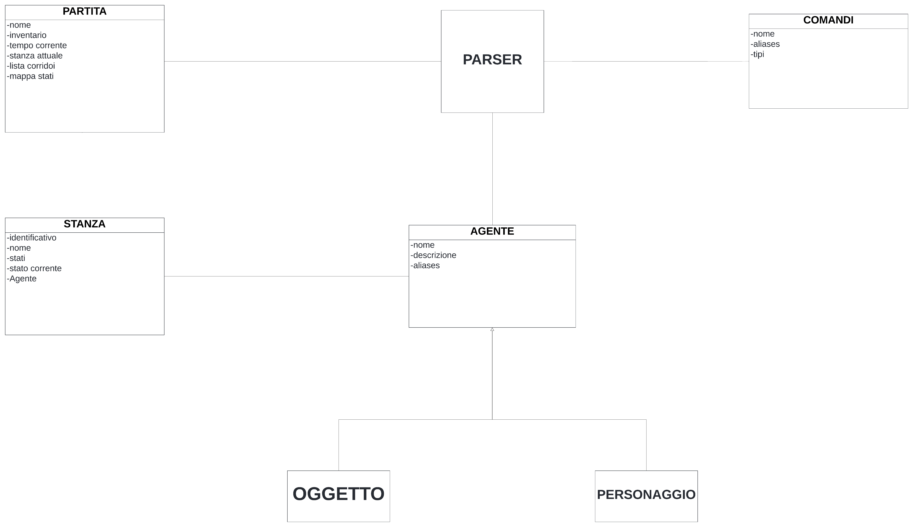
Da questo modello abbiamo successivamente realizzato il progetto basandoci su queste idee base, creando le classi e le interfacce necessarie per la realizzazione del gioco.

#### [Ritorna all'Indice](#indice)

## 3 - Progettazione
- Il nostro principale obiettivo di progettazione è stato:
    - Creare un'architettura modulare e scalabile che permetta di aggiungere nuove funzionalità in modo semplice e flessibile.

## Diagramma delle classi
- Il seguente diagramma rappresenta le classi del nostro progetto, realizzato utilizzando il web software [StarUML](https://www.lucidchart.com/)
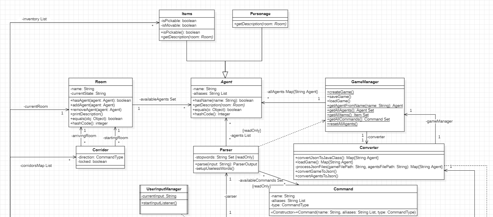
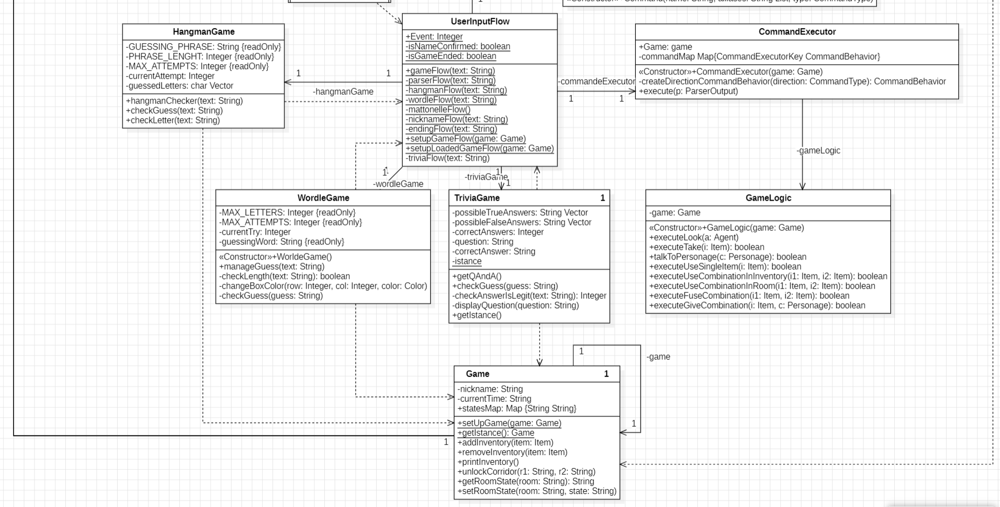

Il diagramma rappresenta il funzionamento del nostro progetto, le classi quindi rappresentano le sequenti informazioni:
- **UserInputManager**: Questa classe è sempre in ascolto tramite un Thread, per ricevere gli input inseriti dall'utente.
- **UserInputFlow**: Questa classe è responsabile di gestire il flusso di input dell'utente,
in particolare si occupa di passare l'input dell utente a seconda dell'evento di gioco in cui il giocatore si trova, indicato dall'attributo event della classe.
Questa classe viene definita come una classe statica, per facilitare l'uso dei suoi funzionamenti nelle altre classi senza andare a creare un oggetto o una copia d'oggetto.
- **CommandExecutor**: Questa classe si occupa di istanziare una Mappa con i comportamenti dei vari comandi e della loro esecuzione.
- **GameLogic**: Questa classe è responsabile di descrivere le azioni particolari del gioco, come l'avvio di eventi speciali e il comportamento dei comandi in base agli agenti sui quali eseguire l'azione. (ex: Parla Sfinge, Osserva Mattonella, Usa Piuma su Pergamena e i comandi Dai,Usa,Fondi)
- **HangmanGame**&&**WorldeGame**&&**TriviaGame**: Queste classi sono responsabili del funzionamento dei minigiochi all'interno della partita.
- **Parser**: Questa classe è responsabile di interpretare i comandi inseriti dall'utente e di tradurli in azioni all'interno del gioco.
- **Command**: Questa classe rappresenta un comando all'interno del gioco, associandolo al suo nome e ai suoi alias con cui può essere riconosciuto dal parser.
- **GameManager**: Gestisce la creazione di una nuova partia, il salvaggio di una partita, il caricamento di una partita. Inoltre si occupa di istanziare una mappa con gli agenti del gioco e l'insieme dei comandi.
- **Converter**: Questa classe è responsabile della conversione di oggetti in JSON e viceversa.
- **Game**: Questa classe Singleton rappresenta la partita, contiene le informazioni principali del gioco, tra cui: il nome del giocatore, il tempo di gioco, l'inventario del giocatore, la stanza attuale dove si trova il giocatore e la mappa di gioco.
- **Room**: Questa classe rappresenta una stanza del gioco, contiene le informazioni principali della stanza tra cui: oggetti, personaggi e lo stato della stanza.
- **Agent**: Questa classe rappresenta un agente del gioco, può essere un oggetto o un personaggio.
- **Item**: Questa classe rappresenta un oggetto all'interno del gioco.Un oggeto può essere raccolto o meno dal giocatore, inoltre un oggetto può essere spostabile o meno da una stanza. 
- **Personage**: Questa classe rappresenta un personaggio all'interno del gioco.
- **Corridor**: Questa classe rappresenta il collegamento tra due stanze la direzione della stanza di arrivo rispetto a quella di partenza. Un corridoio può essere bloccato o meno.

#### [Ritorna all'Indice](#indice)

## 4 - Specifiche Algebriche
Due delle strutture dati più utilizzate nel nostro progetto sono la **Mappa** e la **Lista**, in questa sezione verranno presentate le specifiche algebriche di entrambe.

### 4.1 - Specifica algebrica della Lista
La lista è una struttura dati che permette di memorizzare e recuperare informazioni sfruttando l'indice di posizione degli elementi contenuti.

### Specifica sintattica
<table>
    <thead>
        <tr>
            <th colspan="2">Tipi</th>
        </tr>
    </thead>
    <tbody>
        <tr>
            <td colspan="2"><code>List</code>, <code>Item</code>, <code>Integer</code>, <code>Boolean</code></td>
        </tr>
        <tr>
            <td colspan="2" align="center"><strong>Operatori</strong></td>
        </tr>
        <tr>
            <td><code>newList() -> List</code></td>
            <td>Crea una nuova lista vuota</td>
        </tr>
        <tr>
            <td><code>add(List, Item, Integer) -> List</code></td>
            <td>Aggiunge un elemento alla lista nella posizione specificata</td>
        </tr>
        <tr>
            <td><code>isEmpty(List) -> Boolean</code></td>
            <td>Restituisce <code>true</code> se la lista è vuota altrimenti <code>false</code></td>
          </tr>
            <tr>
                <td><code>getLastIndex(List) -> Integer</code></td>
                <td>Restituisce l'ultima posizione occupata da un elemento</td>
            </tr> 
            <tr>
                <td><code>getIndex(List, Item) -> Integer</code></td>
                <td>Restituisce la posizione dell'elemento specificato</td>
            </tr> 
            <tr>
                <td><code>getItem(List, Integer) -> Item</code></td>
                <td>Restituisce l'elemento nella posizione specificata</td> 
            </tr> 
            <tr>
                <td><code>remove(List, Integer) -> List</code></td>
                <td>Rimuove dalla lista l'elemento nella posizione specificata</td>  
            </tr>
            <tr>
                <td><code>contains(List, Item) -> Boolean</code></td>
                <td>Restituisce <code>true</code> se l'elemento specificato è contenuto nella lista</td>
            </tr>
    </tbody>
</table>
Si noti come <code>Item</code> è un tipo generico, che può essere sostituito con qualsiasi altro tipo di dato.

<code>Interger</code> e <code>Boolean</code> invece, sono tipi ausiliari alla definizione della specifica algebrica della lista.

### Osservazioni e Costruttori

<table>
  <thead>
    <tr>
      <th></th>
      <th colspan="2">Costruttori di l'</th>
    </tr>
  </thead>
  <tbody align="center">
    <tr>
      <td><strong>Osservazioni</strong></td>
      <td><code>newList</code></td>
      <td><code>add(l, it, id)</code></td>
    </tr>
    <tr>
      <td><code>isEmpty(l')</code></td>
      <td><code>true</code></td>
      <td><code>false</code></td>
    </tr>
    <tr>
      <td><code>getLastIndex(l')</code></td>
      <td><code>error</code></td>
      <td>if <code>isEmpty(l)</code> then <code>1</code> else <code>getLastIndex(l) + 1</code></td>
    </tr>
    <tr>
      <td><code>getIndex(l', it')</code></td>
      <td><code>error</code></td>
      <td>if <code>it = it'</code> then <code>id</code> else <code>getIndex(l, it')</code></td>
    </tr>
    <tr>
      <td><code>getItem(l', id')</code></td>
      <td><code>error</code></td>
      <td>if <code>id = id'</code> then <code>it</code> else <code>getItem(l, id')</code></td>
    </tr>
    <tr>
      <td><code>remove(l', id')</code></td>
      <td><code>error</code></td>
      <td>if <code>id = id'</code> then <code>l</code> else <code>add(remove(l, id'), it)</code></td>
    </tr>
    <tr>
      <td><code>contains(l', it')</code></td>
      <td><code>false</code></td>
      <td>if <code>it = it'</code> then <code>true</code> else <code>contains(l, it')</code></td>
    </tr>
  </tbody>
</table>

### Specifica semantica
- **DECLARE**
  - <code>l</code>, <code>l'</code>: <code>List</code>
  - <code>it</code>, <code>it'</code>: <code>Item</code>
  - <code>id</code>, <code>id'</code>: <code>Integer</code>

- **OPERATIONS**
  - <code>isEmpty(newList)</code> = <code>true</code>
  - <code>isEmpty(add(l, it, id))</code> = <code>false</code>
  - <code>getLastIndex(add(l, it, id))</code> = if <code>isEmpty(l)</code> then <code>1</code> else <code>getLastIndex(l) + 1</code>
  - <code>getIndex(add(l, it, id), it')</code> = if <code>it = it'</code> then <code>id</code> else <code>getIndex(l, it')</code>
  - <code>getItem(add(l, it, id), id')</code> = if <code>id = id'</code> then <code>it</code> else <code>getItem(l, id')</code>
  - <code>remove(add(l, it, id), id')</code> = if <code>id = id'</code> then <code>l</code> else <code>add(remove(l, id'), it)</code>
  - <code>contains(newList, it')</code> = <code>false</code>
  - <code>contains(add(l, it, id), it')</code> = if <code>it = it'</code> then <code>true</code> else <code>contains(l, it')</code>

### Specifica di restrizione
- **RESTRICTIONS**
  - <code>getLastIndex(newList)</code> = <code>error</code>
  - <code>getIndex(newList, it')</code> = <code>error</code>
  - <code>getItem(newList, id')</code> = <code>error</code>
  - <code>remove(newList, id')</code> = <code>error</code>

### 4.2 - Specifica algebrica della Mappa

- La mappa è una struttura dati che associa una chiave ad un valore, permettendo di memorizzare e recuperare informazioni in modo efficiente.

### Specifica sintattica
<table>
    <thead>
        <tr>
            <th colspan="2">Tipi</th>
        </tr>
    </thead>
    <tbody>
        <tr>
            <td colspan="2">Map, Key, Value, Boolean, Integer</td>
        </tr>
        <tr>
            <td colspan="2"><strong>Operatori</strong></td>
        </tr>
        <tr>
            <td><code>newMap() -> Map</code></td>
            <td>Crea una nuova mappa vuota</td>
        </tr>
        <tr>
            <td><code>isEmpty(Map) -> Boolean</code></td>
            <td>Restituisce <code>true</code> se la mappa è vuota, <code>false</code> altrimenti</td>
        </tr>
        <tr>
            <td><code>put(Map, Key, Value) -> Map</code></td>
            <td>Aggiunge una coppia chiave-valore alla mappa, o, se già presente, ne aggiorna il valore</td>
        </tr>
        <tr>
            <td><code>get(Map, Key) -> Value</code></td>
            <td>Restituisce il valore associato alla chiave specificata</td>
        </tr>
        <tr>
            <td><code>containsKey(Map, Key) -> Boolean</code></td>
            <td>Restituisce <code>true</code> se la chiave specificata è presente nella mappa</td>
        </tr> 
        <tr>
            <td><code>containsValue(Map, Value) -> Boolean</code></td>
            <td>Restituisce <code>true</code> se il valore specificato è presente nella mappa</td> 
        </tr>
        <tr>
            <td><code>remove(Map, Key) -> Map</code></td>
            <td>Rimuove la chiave ed il valore associato ad essa dalla mappa</td>
        </tr> 
        <tr>
            <td><code>size(map) -> Integer</code></td>
            <td>Restituisce il numero di coppie chiave-valore presenti nella mappa</td>  
        </tr>
    </tbody>
</table>

### Osservazioni e Costruttori

<table>
  <thead>
    <tr>
      <th></th>
      <th colspan="2">Costruttori di m'</th>
    </tr>
  </thead>
  <tbody align="center">
    <tr>
      <td><strong>Osservazioni</strong></td>
      <td><code>newMap</code></td>
      <td><code>put(m, k, v)</code></td>
    </tr>
    <tr>
      <td><code>isEmpty(m')</code></td>
      <td><code>true</code></td>
      <td><code>false</code></td>
    </tr>
    <tr>
      <td><code>containsKey(m', k')</code></td>
      <td><code>false</code></td>
      <td>if <code>k = k'</code> then <code>true</code> else <code>containsKey(m, k')</code></td>
    </tr>
    <tr>
      <td><code>containsValue(m', v')</code></td>
      <td><code>false</code></td>
      <td>if <code>v = v'</code> then <code>true</code> else <code>containsValue(m, v')</code></td>
    </tr>
    <tr>
      <td><code>get(m', k')</code></td>
      <td><code>error</code></td>
      <td>if <code>k = k'</code> then <code>v</code> else <code>get(m, k')</code></td>
    </tr>
    <tr>
      <td><code>remove(m', k')</code></td>
      <td><code>error</code></td>
      <td>if <code>k = k'</code> then <code>m</code> else <code>put(remove(m, k'), k, v)</code></td>
    </tr>
    <tr>
      <td><code>size(m')</code></td>
      <td><code>0</code></td>
      <td>if <code>isEmpty(m)</code> then <code>1</code> else <code>size(m) + 1</code></td>
    </tr>
  </tbody>
</table>

### Specifica semantica

- **DECLARE**
  - <code>m</code>, <code>m'</code>: <code>Map</code>
  - <code>k</code>, <code>k'</code>: <code>Key</code>
  - <code>v</code>, <code>v'</code>: <code>Value</code>

- **OPERATIONS**
  - <code>isEmpty(newMap)</code> = <code>true</code>
  - <code>isEmpty(put(m, k, v))</code> = <code>false</code>
  - <code>containsKey(newMap, k')</code> = <code>false</code>
  - <code>containsKey(put(m, k, v), k')</code> = if <code>k = k'</code> then <code>true</code> else <code>containsKey(m, k')</code>
  - <code>containsValue(newMap, v')</code> = <code>false</code>
  - <code>containsValue(put(m, k, v), v')</code> = if <code>v = v'</code> then <code>true</code> else <code>containsValue(m, v')</code>
  - <code>get(put(m, k, v), k')</code> = if <code>k = k'</code> then <code>v</code> else <code>get(m, k')</code>
  - <code>remove(put(m, k, v), k')</code> = if <code>k = k'</code> then <code>m</code> else <code>put(remove(m, k'), k, v)</code>
  - <code>size(newMap)</code> = <code>0</code>
  - <code>size(put(m, k, v))</code> = <code>size(m) + 1</code>

### Specifica di restrizione

- **RESTRICTIONS**
  - <code>get(newMap, k')</code> = <code>error</code>
  - <code>remove(newMap, k')</code> = <code>error</code>
#### [Ritorna all'Indice](#indice)

## 6 - Applicazione Argomenti del Corso

- In questa sezione verrà spiegato come il progetto "Avventura nella Piramide" si collega agli argomenti trattati durante il corso di "Metodi Avanzati di Programmazione".

[Applicazione Argomenti del Corso](Applicazione%20Argomenti%20del%20corso.md)

#### [Ritorna all'Indice](#indice)
## 7 - Manuale Utente
In questa sezione verrà spiegato come utilizzare l'avventura testuale "Avventura nella Piramide"

L'installazione del progetto può essere effettuata tramite la lettura della
[Guida all'installazione](README.md)

Prima di entrare nel vivo del gioco, è importante conscere come è strutturata la mappa del gioco, mostrata qui di seguito:

## Walkthrough
## Capitolo 1: Deserto
Avviando una nuova partita, il giocatore si troverà disperso in un deserto.

Nella stanza sono presenti:
- **Sfinge** - Una sfinge tipica egizia.
- **SfingeCane** - Una Sfinge a forma di cane.
- **Pala** - Una pala, è consigliato prenderla perché servirà in seguito.
- **Chiave** - verrà data al giocatore quando vincerà l'enigma della sfinge o se userà la pala per trovare la chiave.
### Capitolo 1.1: Enigma della Sfinge
Usando il comando `Parla Sfinge`, si avvierà un minigioco:

Il minigioco è un Wordle clone, la parola è scelta in modo casuale da un API.
Se il minigioco viene completato con successo, le porte della piramide si apriranno.
Altrimenti se una persona fallisce o non fa il minigioco, può usare il comando `Prendi Pala`, se il giocatore usa il comando `Parla SfingeCane`, gli dirà di scavare per poter trovare la chiave per aprire la porta della piramide. Con il comando `Usa Pala` sarà ottenuta la **Chiave** per aprire le porte della piramide, usando il comando `Usa Chiave su Portone`.
Usando il comando `Nord` si entrerà nella piramide, accedendo alla prima stanza.
## Capitolo 2: Primi passi nella piramide
### Capitolo 2.1: Enigma delle Torce
Entrando nella Piramide, entriamo nella **Stanza Iniziale**, la stanza è buia e si può accedere solo alle due stanze laterali, se la stanza invece è illuminata e si usa il comando `Osserva` si può notare una **Statua**, sarà usata per completare l'enigma delle torce.
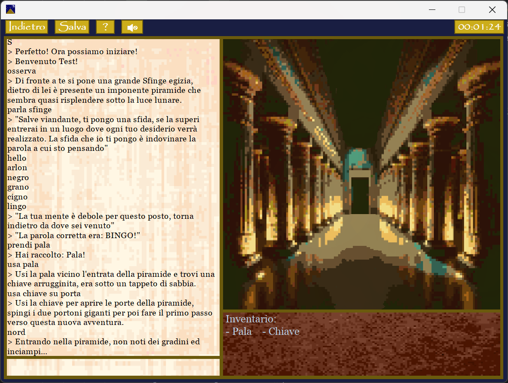
Nella stanza è presente:
- **Statua** - Una statua che serve per andare avanti, quando l'enigma sarà risolto.
#### Capitolo 2.1.1: Stanza dei Serpenti
Usando il comando `Ovest` entreremo nella **Stanza dei Serpenti**.
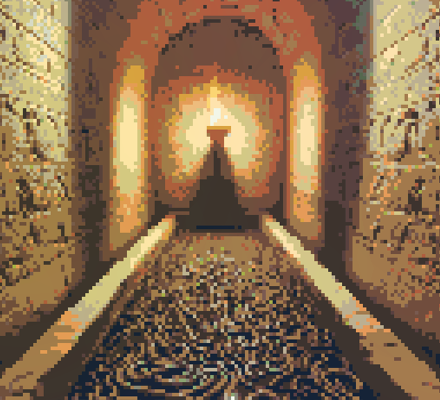
Nella stanza sono presenti:
- **Bastone** - Un bastone di legno, utile per risolvere l'enigma della stanza attuale.
- **Corda** - Una corda, utile per risolvere l'enigma della **Stanza della Cascata** e successivamente per la **Stanza del Tiro con l'Arco**.
- **Serpenti** - Serpenti che bloccano il giocatore dal prendere la torica.
- **TorciaSinistra** - Torcia che serve per risolvere l'enigma della prima Stanza.
  Se non si è passati per la **Stanza della Cascata** l'enigma non può essere risolto, quindi andremo nella **Stanza della Cascata** tornando dalla **Stanza Inziale** con il comando `Est`.
#### Capitolo 2.1.2: Stanza della Cascata
Usando il comando `Est` entreremo nella **Stanza della Cascata**.

Nella stanza sono presenti:
- **Coltello** - Un coltello, utile per risolvere l'enigma della **Stanza dei Serpenti** e successivamente per la **Stanza del Tiro con l'Arco**.
- **Leva** - Una leva, utile per risolvere l'enigma della stanza attuale..
- **Cascata** - Una Cascara che blocca il giocatore dal prendere la torcia.
- **TorciaDestra** - Torcia che serve per risolvere l'enigma della prima Stanza.
  Se non si è passati prima per la **Stanza dei Serpenti** l'enigma non può essere risolto, quindi andremo nella **Stanza dei Serpenti** tornando dalla **Stanza Iniziale** con il comando `Ovest`.
### Capitolo 2.2: Risolvere Enigma
#### Capitolo 2.2.1: Enigma dei Serpenti
Per risolvere l'enigma della **Stanza dei Serpenti** ci servono i seguenti oggetti:
***Bastone***, ***Coltello***.
Useremo i seguenti comandi nella **Stanza dei Serpenti**:
1. `Usa Coltello su Bastone` : con questo comando otteniamo il **Piffero**.
2. `Usa Piffero su Serpenti` : eseguendo questo comando, i **Serpenti** non saranno più un problema.
3. `Prendi TorciaSinistra` : Ora possiamo prendere la **TorciaSinistra** che ci servirà per risolvere l'enigma della **Stanza Iniziale**.
#### Capitolo 2.2.2: Enigma della Cascata
Per risolvere l'enigma della **Stanza della Cascata** ci servono il seguente oggetto:
***Corda***.
Useremo i seguenti comandi nella **Stanza della Cascata**:
1. `Usa Corda su Leva` : con questo comando, la **Cascata** sarà disattivata.
2. `Prendi TorciaDestra` : Ora possiamo prendere la **TorciaDestra** che ci servirà per risolvere l'enigma della **Stanza Iniziale**
#### Capitolo 2.2.3: Fine enigma delle Torce
Tornati nella **Stanza Iniziale** e avendo gli oggetti **TorciaSinistra** e **TorciaDestra**, possiamo risolvere l'enigma per andare avanti con l'avventura, eseguendo i due comandi:
- `Usa TorciaSinistra su Statua`
- `Usa TorciaDestra su Statua`
  Il corridoio per la prossima stanza ora è sbloccato, si può usare il comando `Nord` per andare avanti.
## Capitolo 3: Il Corridoio delle Sfide
Dalla **Stanza Iniziale** andando verso il `Nord`, il giocatore dovrà risolvere 3 sfide per poter andare avanti.
### Capitolo 3.1: Sfida di Scrittura
Usando il comando `Nord` entreremo nella **Stanza dello Scriba**.
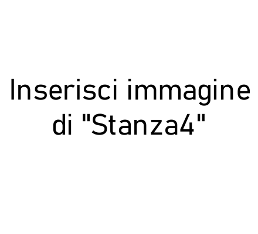
nella stanza troveremo i seguenti oggetti:
- **Piuma** - Una piuma, utile a risolvere la sfida della stanza e successivamente servirà per la **Stanza del Tiro con l'Arco**.
- **Pergamena** - Una Pergamena, serve per iniziare la sfida da completare.
  Usando il comando `Usa Piuma su Pergamena`, inizierà la sfida da completare.
  La sfida consiste in un **Impiccato** dove si dovrà indovinare la frase.
  
  La parola è: ***Ti trovi nella Piramide di Osiride***.
  Completando la sfida, il corridoio si apre, si può usare il comando `Nord` per andare avanti.
### Capitolo 3.2: Sfida del Tiro con l'Arco
Usando il comando `Nord` entreremo nella **Stanza del Tiro con l'Arco**.
In questa Stanza l'utente dovrà colpire l'obiettivo con l'Arco e la Freccia.
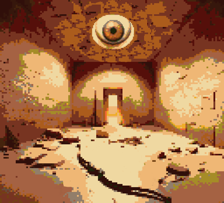
Nella stanza sono presenti:
- **ArcoRotto** - Un Arco che dovrà essere aggiustato e unito con la freccia per completare la sfida.
- **FrecciaRotta** - Una Freccia che dovrà essere aggiustata e unita con l'arco per completare la sfida.
- **Occhio** : L'obiettivo da colpire per andare avanti e sbloccare il prossimo corridoio.
  Per aggiustare l'**ArcoRotto** eseguiremo i seguenti comandi:
1. `Fondi Corda su ArcoRotto`, otterremo ora un **Arco**.
   Per aggiustare la **FrecciaRotta** eseguiremo i seguenti comandi:
1. `Usa Coltello su FrecciaRotta`, otterremo cosi una **FrecciaAppuntita**.
2. `Fondi FrecciaRotta con Piuma`, otterremo cosi una **Freccia**.
   Usando il comando `Fondi Arco e Freccia` otteniamo l'oggetto **ArcoFreccia** che ci servirà per finire la sfida, usando il comando `Usa ArcoFreccia su Occhio`, avremo completato la sfida e si aprirà il corridoio che ci permette di continuare usando il comando `Nord`.
### Capitolo 3.3: Sfida di Trivia
Usando il comando `Nord` entriamo nella **Stanza dei Trivia**.
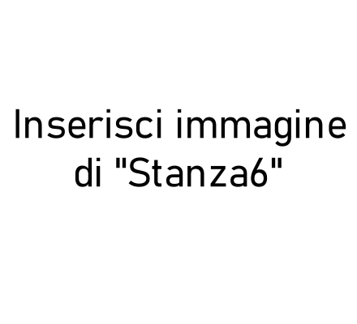
Nella stanza è presente solo:
- **Mummia** - Una mummia anziana con cui l'utente può parlare e iniziare la sfida.
  Usando il comando `Parla Mummia` inizierà la sfida.
  La sfida è composta in 3 domande vero e falso, scelto in modo casuale da un API.
  Se le 3 risposte sono corrette si potrà andare in avanti, usando il comando `Nord`.
## Capitolo 4: La Stanza del Faraone
Usando il comando `Nord` entriamo nella **Stanza del Faraone**.
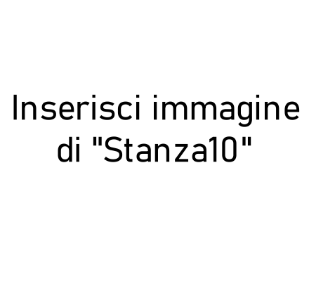
Nella stanza sono presenti:
- **Sarcofago** - Il Sarcofago del Faraone servirà aprirlo per poter andare avanti.
- **Faraone** - All'inizio è dentro il Sarcofago, quando sarà aperto si potrà parlare con lui e continuare la sfida.
  Per aprire il **Sarcofago** l'utente dovrà avere l'oggetto **Pala**, trovabile nel **Deserto**. nell'inventario, cosi da poter usare il comando `Usa Pala su Sarcofago`.
  Aprendo il Sarcofago sarà possibile usare il comando `Parla Faraone`, attivando la fase successiva della sfida.
  Il faraone dirà di trovare i 3 oggetti: ***Ankh***, ***Hekat***, ***Nekhekh***.
### Capitolo 4.1: Sfida delle mattonelle
Usando il comando `Est` si entrerà nella **Stanza delle Mattonelle**.
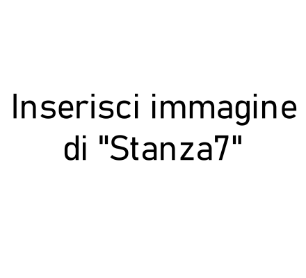
Nella stanza sono presenti:
- **Mattonelle** - Le Mattonelle della stanza serviranno per iniziare la sfida.
- **Nekhekh** - Tesoro da dare al Faraone.
  Per iniziare la sfida si userà il comando `Osserva Mattonelle`.
  L'utente dovrà cliccare sui pulsanti presenti sullo schermo in in modo corretto.
  La soluzione alla sfida è la seguente:
  *Centro*, *Sinistra*, *Destra*, *Destra*, *Sinistra*, *Destra*, *Centro*.

  Dopo aver completato la sfida, usando il comando `Prendi Nekhekh` otteniamo il tesoro da dare al **Faraone**, ora possiamo tornare nella **Stanza del Faraone** usando il comando `Ovest`.
### Capitolo 4.2: Sfida della Torta
Usando il comando `Ovest` si entrerà nella **Stanza della Torta**.
Dato l'indizio della stanza, l'obiettivo è quello di creare una **Torta**.

Nella Stanza sono presenti:
- Gli ingredienti per creare la torta:
  **Grano** - **CannaZucchero** - **Uova** - **LatteVecchio**
- **Pietra** - Sarà usata per creare la **Farina** e lo **Zucchero**.
- **Fuoco** - Sarà usato per cuocere l'**Impasto**.
- **Piedistallo** - Segnerà che la sfida sia stata completata.
-  **Ankh** - Il Tesoro da dare al Faraone.
   Ecco la lista dei comandi per finire la sfida:
1. `Usa Pietra su Grano` : otteniamo la **Farina**.
2. `Usa Pietra su CannaZucchero` : otteniamo lo **Zucchero**.
3. `Fondi Farina e Uova` : otteniamo l'**Impasto Umido**.
4. `Fondi ImpastoUmido e Zucchero` : otteniamo l'**ImpastoCompleto**.
5. `Usa ImpastoCompleto su Fuoco` : otteniamo **ImpastoCotto**.
6. `Fondi ImpastoCotto su LatteVecchio` : otteniamo l'oggetto finale **Torta**.
7. `Usa Torta su Piedistallo` : otteniamo l'**Ankh**.
   Completando la sfida otterremo l'**Ankh**, il tesoro da dare al Faraone, ora possiamo tornare nella **Stanza del Faraone** usando il comando `Est`.
### Capitolo 4.3: Enigma di Luce
Usando il comando `Nord` entreremo nella **Stanza del Buco**.
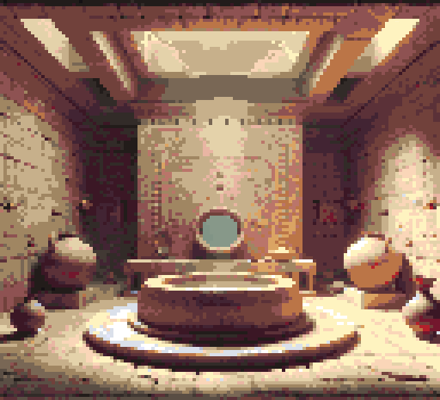
Nella Stanza sono presenti:
- Gli oggetti per risolvere l'enigma
  **Acqua** - **Olio** - **Vetro**
- **Buca** - Servirà per avere il tesoro del Faraone, quando l'enigma sarà risolto.
- ***Hekat*** - Il Tesoro da dare al Faraone.
  Per completare l'enigma saranno eseguiti i seguenti comandi nel ordine preciso:
1. `Usa Olio su Buca` : è il primo passaggio per risolvere l'enigma.
2. `Usa Vetro su Buca` : è il secondo passaggio per risolvere l'enigma.
3. `Usa Acqua su Buca`: è il terzo e ultimo passaggio per risolvere l'enigma, rivelando l'**Hekat**.
   Dopo aver completato l'enigma potremo usare il comando `Prendi Hekat` per poter ricevere il Tesoro da dare al Faraone, ora possiamo tornare nella **Stanza del Faraone** usando il comando `Sud`.
### Capitolo 4.4: Il Premio del Faraone
Tornando nella **Stanza del Faraone** e usando i comandi:
- `Dai Hekat a Faraone`
- `Dai Nekhekh a Faraone`
- `Dai Ankh a Faraone`
  Arriviamo allo stato finale del gioco, dove l'utente con il comando `Parla con Faraone`, dove alla fine del gioco l'utente potrà scegliere uno dei due finali: **Ricchezza** o **Saggezza**.

#### [Ritorna all'Indice](#indice)

## 8 - Conclusioni e Opinioni Finali
Concludiamo il nostro progetto, siamo molto soddisfatti del lavoro svolto, abbiamo imparato molto durante il corso e siamo riusciti a mettere in pratica le nozioni apprese.
Il progetto è stato molto impegnativo, ma allo stesso tempo molto divertente, ci ha permesso di mettere alla prova le nostre capacità di programmazione e di lavorare in team.
Siamo molto orgogliosi del risultato finale e speriamo che il nostro gioco possa essere apprezzato da tutti coloro che lo proveranno.
Un ringraziamento speciale al Prof. Pierpaolo Basile per averci dato l'opportunità di realizzare questo progetto e per averci supportato durante tutto il corso.
#### [Ritorna all'Indice](#indice)
